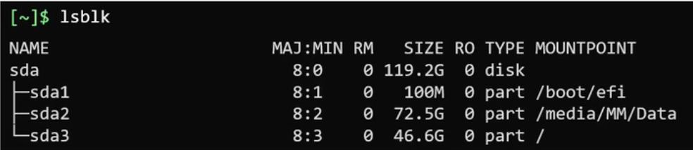
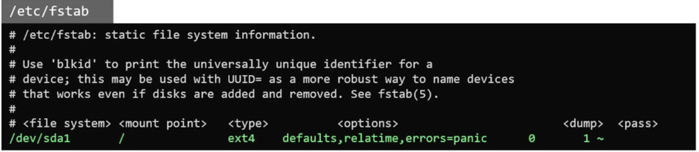
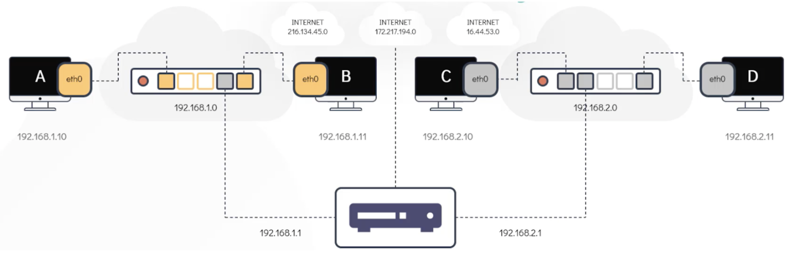
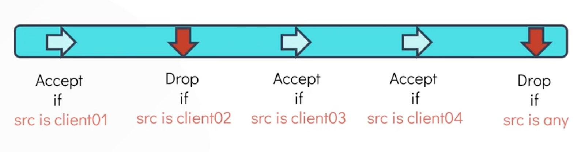
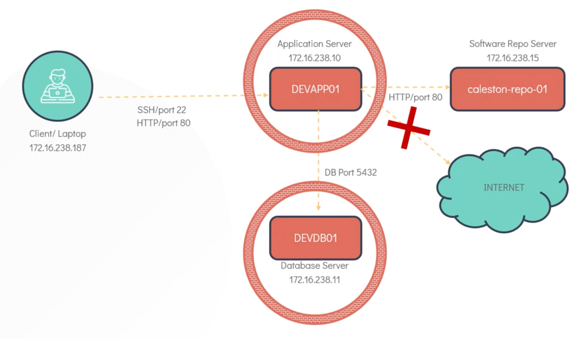

# 📝 Concetti di base

Il core del sistema operativo è il `kernel`. Il kernel si occupa di gestire la memoria (RAM),
gestire i processi del sistema (CPU), gestire i device fisici (comunicazione fra processi e
hardware) e offrire agli applicativi accesso controllato all'hardware. Il kernel è monolitico
ma modulare, cioè può estendere le sue capacità tramite moduli caricabili a runtime.

Il sistema operativo si divide fra `kernel space` (processi e risorse usati dal kernel) e
`user space` (processi applicativi). I programmi in user space interagiscono con l’hardware
comunicando col kernel via `system calls`. Una system call è una richiesta specifica
al kernel, dove il kernel prende il controllo, esegue le operazioni richieste e restituisce
il risultato e/o eventuali errori.

## Hardware

Quando un device è collegato un device driver detecta il device è genera un evento (_uevent_)
che viene inoltrato ad un processo userspace chiamato `udev`. Quest’ultimo processa l’evento
creando una `device file` (che rappresenta il device) in una cartella, tipicamente `/dev` (e.g.
`/dev/sdd1`).

Il comando `dmesg` ottiene messagi e logs generati dal kernel. Questi messaggi contengono
anche log relativi all’hardware, per cui è possibile debuggare o saperne di più sui device
collegati tramite questo comando. Inoltre il comando `udevadm` interroga udev per ottenere
informazioni sui device e sugli eventi udev. Il comando invece `lspci` riporta informazioni
sugli hardware attaccati alle porte PCI. Il comando `lsblk` lista informazioni
esclusivamente sui block devices, sui dischi e le loro partizioni. Il comando `lscpu`
fornisce informazioni sulla CPU. Il comando `lsmem` fornisce informazioni sulla RAM
(provare con e senza --summary è utile), mentre `free -m` fornisce informazioni sulla memoria
usata e libera. Il comando `lshw` fornisce info su tutto l’hardware del sistema.

## Boot Sequence

Approfondimento **consigliato** su Linux boot sequence:
https://www.happyassassin.net/posts/2014/01/25/uefi-boot-how-does-that-actually-work-then/

Il boot di un sistema Linux è composto fondamentalmente da 4 step.

- **POST**. Componente base del firmware del sistema che si assicura che tutto l’hardware
  collegato funzioni correttamente.
- **UEFI** (rimpiazza BIOS). Firmware della scheda madre che si occupa di caricare in
  memoria ed
  avviare sulla CPU il primo non-firmware (tipicamente bootloader). UEFI è un firmware
  "intelligente" in grado di leggere certe partizioni da disco, in particolare quelle
  formattate
  con filesystem EFI, dove tipicamente si trova il bootloader. Una piccola memoria persistente
  (NVRAM) salva le `boot entries`, ovvero una lista di indicazioni su come e da dove eseguire
  il
  successivo step di boot. La NVRAM viene letta all'avvio dal firmware UEFI (consiglio link
  sopra per una spiegazione più completa).
- **Bootloader (GRUB)**. Si occupa di caricare il kernel in memoria e gli da il controllo
  della CPU.
- **Kernel init**. Il sistema operativo inizializza driver, memoria, strutture dati interne
  etc.
- **User space init**. Avvia il processo init (PID 1) dello user space, lo standard è
  `systemd` ai giorni nostri.

Il runlevel è una modalità operativa del sistema operativo, ad esempio il boot fino al
terminale (raw) è considerato livello 3, per interfaccia grafica tipicamente 5. Per ogni
runlevel esistono delle componenti software da avviare e verificare ed ogni runlevel
corrisponde ad un target systemd (e.s. 3 = terminale = multiuser.target, 5 = grafico =
graphical.target). Il comando systemctl può essere usato per verificare il runlevel di
default e modificarlo. Notare che il termine runlevels è usato nei sistemi con sysV init.
Questi sono stati sostituiti da target systemd nei sistemi basati su di esso. L'elenco
completo dei runlevel e dei corrispondenti target di sistema è il seguente.

- _runlevel 0_: `poweroff.target`
- _runlevel 1_: `rescue.target`
- _runlevel 2_: `multi-user.target`
- _runlevel 3_: `multi-user.target`
- _runlevel 4_: `multi-user.target`
- _runlevel 5_: `graphical.target`
- _runlevel 6_: `reboot.target`

# 🕹️ Shell

Si usa la shell come uno specifico utente del sistema. I comandi dati alla shell si
dividono in due categorie. Quelli interni sono parte della shell (del binario shell) e sono
ad esempio _echo_, _cd_, _pwd_, etc. Quelli esterni sono degli eseguibili a sé (es. _mv_, _cp_,
_uptime_) e si trovano in una cartella del sistema listata nella variabile d'ambiente `PATH`.
E’ possibile distinguerli usando il comando `type <command>`.

```shell
$ type mv       # mv is /bin/mv
$ type echo     # echo is a shell builtin

$ echo $SHELL   # /bin/bash
```

Esistono diversi tipi di shell, la env var `SHELL` mostra la shell di default sul sistema. Per
settare una shell di default diversa è possibile usare `chsh`.

## Bash

Bash (_bourne again shell_) è fra le shell più utilizzate. Fra le altre cose, offre auto
completamento e alias.

Bash supporta l’uso di variabili di shell e variabili d’ambiente. Le prime sono legate solo
alla corrente sessione, mentre le seconde sono anche passate ai processi figli della shell
corrente (`env` per printare var d’ambiente). Il comando `export` crea una nuova env var. E'
possibile farla permanere aggiugnengo l'export in `~/.profile` e `~/.bash_profile`.

La env `PATH` controlla i posti dove i binari dei comandi vengono cercati per essere eseguiti
quando si invoca un dato comando.

```shell
# set and use shell variable
$ MY_VAR=67		            
$ echo ${MY_VAR}		    

# print all env vars, then export a new one
$ env
$ export MY_ENV=67

# persist new env var
$ echo 'export MY_ENV=67' >> ~/.profile
$ echo 'export MY_ENV=67' >> ~/.bash_profile
```

### IO redirection

Ogni processo viene lanciato con tre file descriptor aperti di default:

- `STDIN`: standard input, il processo accetta input attraverso questo fd
- `STDOUT`: standard output, di default il processo scrive su questo fd
- `STDERR`: standard error, fd usato per scrivere errori

E’ possibile redirezionare questi stream verso altre destinazioni. La destinazione può
essere un altro processo, una pipe oppure un file/device.

- `>` redirect di standard output, sovrascrivendo contenuto
- `>>` redirect di standard output, append al contenuto
- `2>` redirect di standard error, sovrascrivendo contenuto
- `2>>` redirect di standard error, append al contenuto
- `<` read standard input from source
- `1>&2` redirect standard output to standard error
- `2>&1` redirect standard error to standard output

```shell
# send STDOUT of ls command to one file, overwriting it
# send STDERR to another file, appending this new content
$ ls -alh > listing.txt 2>> list-err.txt

# start a specific program, reads STDIN from json file
# and discard errors sent to STDERR
$ my-command < input.json 2> /dev/null
```

E’ possibile connettere lo STDOUT di un processo allo STDIN di un secondo comando tramite le
`shell pipes` (simbolo `|`). Il comando `tee` di seguito ha la funzione di splittare l’output:
il comando scrive nella destinazione specificata, ma anche sullo STDOUT.

```shell
# list files in current directory, output is the
# input of wc, which counts the number of lines
$ ls -alh | wc -l

# list files in current directory, output is BOTH
# send to next command and written in a file
$ ls -alh | tee listing.txt | wc -l
```

### Bash customization

La prompt di bash può essere customizzata attraverso la env var `PS1`, che è un template del
nostro prompt, personalizzabile attraverso alcuni caratteri speciali. Ad esempio con
`PS1="[\d \w example]$"` il nostro prompt sarà composto da, es. [Tue May 26 /etc/nginx]$.
La modifica del prompt per essere permanentemente deve essere salvato in `~/.profile` e
`~/.bash_profile`. Di seguito una lista non esaustiva di opzioni.

- `\a` : an ASCII bell character (07)
- `\d` : the date in "Weekday Month Date" format (e.g., "Tue May 26")
- `\e` : an ASCII escape character (033)
- `\h` : the hostname up to the first '.'
- `\H` : the hostname
- `\j` : the number of jobs currently managed by the shell
- `\n` : newline
- `\r` : carriage return
- `\s` : the name of the shell
- `\t` : the current time in 24-hour HH:MM:SS format
- `\T` : the current time in 12-hour HH:MM:SS format
- `\@ `: the current time in 12-hour am/pm format
- `\A` : the current time in 24-hour HH:MM format
- `\u` : the username of the current user
- `\v` : the version of bash (e.g., 2.00)
- `\V` : the release of bash, version + patch level (e.g., 2.00.0)
- `\w` : the current working directory, with $HOME abbreviated with a tilde
- `\W` : the basename of the current working directory, with $HOME abbreviated with a tilde
- `\! `: the history number of this command
- `\# `: the command number of this command
- `\$` : if the effective UID is 0, a #, otherwise a $
- `\nnn` : the character corresponding to the octal number nnn

For colors: https://misc.flogisoft.com/bash/tip_colors_and_formatting

### Symbols & help

- `.` directory corrente
- `..` directory superiore
- `~` home directory
- `*` wildcard

- `$0, $1, $n` positional parameters, passed from command line
- `$#` number of command-line arguments
- `$$` pID of the shell itself


- `${VAR}` parameter substitution
- `$VAR` parameter substitution

#### Help

- `whatis <comand>`: one line description del comando
- `man <comand>`:    manuale del comando
- `<comand> --help/-h`: istruzioni sul comando
# 📝 Files

_Tutto è un file in Linux_ o quasi. Questo è un motto del mondo Linux, dove molte cose sono
modellate ed esposte con un interfaccia file-simile.

Esistono diversi tipi di file:

- `regular files`, `-`: normal files
- `directory files`, `d`: directories
- special files:
    - `character files`, `c`: rappresentano device con cui si comunica in modo seriale
    - `block files`, `b`: rappresentano device con cui si comunica tramite blocchi di dati
    - `hard link files`, `-`: puntatori reali ad un file su disco, eliminare l’ultimo
      significa eliminare il file
    - `soft link files`, `l`: shortcut verso un altro file, ma non i dati
    - `socket files`, `s`: file per comunicazione fra processi, via network e non
    - `pipes files`, `p`: file per comunicazione unidirezionale fra due processi

Esistono due comandi utili per esaminare il tipo di un file:

```shell
# reports the type and some additional info about a file
$ file <path>

# list file(s) and some infos like number of hard links, 
# permissions, size , etc.
$ ls -alh [file, ...] 
```

Il filesystem linux è organizzato per convenzione secondo la seguente gerarchia.

- `/home`   -> contiene le cartelle degli utenti è aliasata dal simbolo ~ (tilde)
- `/root`   -> home dell’utente root

- `/media`  -> montati filesystem di device esterni e rimuovili (es. USB)
- `/dev`    -> contiene i file speciali di tipo carattere e blocco (es. hard disk, mouse, etc)
- `/mnt`    -> filesystem montati temporaneamente

- `/opt`    -> dove vengono installati programmi di terze parti
- `/etc`    -> usata tipicamente per file di configurazione
- `/bin`    -> contiene i binari dei software di sistema
- `/lib`    -> contiene librerie (statiche e dinamiche) dei software di sistema
- `/usr`    -> contiene i binari di applicazioni degli utenti
- `/var`    -> contiene tipicamente dati scritti da applicazioni, es logs e caches

- `/tmp`    -> cartella con file e dati temporanei

## File manipulation

### Archival and compression

Il comando tar è usato per raggruppare file e creare archivi (definiti tarballs). Il comando
ls supporta un flag per vedere dentro una tarball. I comandi più utili sono:

```shell
# create tarball from specified files
$ tar -cf <output> <files..>

# create tarball and compress it
$ tar -zcf <output> <files..>

# look at the tarball contents
$ tar -tf <tarball>

# extract contents in specified directory
$ tar -xf <tarball> -C <output_dir>
```

La compressione riduce la dimensione dei file, fra le utilities più utili ci sono `bzip2`,
`gzip` e `xz`. Ogni utility può utilizzare diversi algoritmi e diversi livelli compressione.
Non serve sempre decomprimere un file per poterlo leggere, es. `zcat` legge un file
compresso senza decomprimerlo davvero.

```shell
# compress a file
$ gzip --keep -v <file>
# decompress a file
$ gzip/gunzip --keep -vd <file>
```

### Searching & grepping

Il comando `find` cerca un file in una specifica director. Il comando find è potente e
supporta un ricco set di flags ed opzioni, è ricorsivo di default. Ecco alcuni esempi.

```shell
# general usage pattern
$ find <root-di-ricerca> -name <nome-file>

# find files under /home directory with a specific name
$ find /home -name file.txt
# same but ignore case, and use wildcards
$ find /home -iname "file.*"
# find directories, not files
$ find /home -type d -name <dir_name>

# find files whose permissions are 777 owned by the user
$ find /home -type f -perm 0777 -user <user>
# find files and for each of them exec a command
$ find /home -type f -perm 0777 -exec chmod 644 {} \;
```

Esiste anche il comando `locate` cerca un file nel filesystem, ma si base su un DB locale
creato ed aggiornato periodicamente e non sempre necessariamente aggiornato (`updatedb` per
riaggiornare).

Il comando **`grep`** è molto utilizzato per cercare pattern all’interno di files.

- `-i`    ricerca case insensitive (di default è case sensitive)
- `-r`    ricerca ricorsiva in tutti i file a partire da una root
- `-v`    ricerca per linee dove non c’è match col pattern
- `-w`    matcha solo le parole e non le substring di parole
- `-A <n>`    riporta i match e _n_ linee dopo
- `-B <n>`    riporta i match e _n_ linee prima

```shell
# general usage pattern
$ grep <options> <pattern> <files>

# grep lines starting with hello in txt files 
$ grep "^hello" *.txt
# grep lines starting with "fn" and some lines around, 
# recursive mode starting from current directory
$ grep -A 3 -B 2 -r -i "^fn" .
```

## Permissions

Ogni file ha degli attributi, di solito visibili tramite `ls -l`, nel seguente formato:
`-rwxrwxrwx`. Dove la prima lettera indica il tipo di file e le altre i permessi del file,
raggruppati per proprietario (3 bit), gruppo del proprietario (3 bit), tutti gli altri (3 bit).
Un gruppo di permessi lista cosa si può fare e da chi con quel file.

Un gruppo di permessi è rappresentato come 3 bit (4=read, 2=write, 1=execute, un set di
permessi può essere espresso come la somma di questi 3 bit). Lo stesso discorso di permessi
vale anche per le directory.

- `r`: leggere file o listare contenuti directory
- `w`: scrivere su file o scrivere nuovo file in directory
- `x`: eseguire file o accedere alla cartella

I permessi sono verificati sequenzialmente: utente se applicabile, gruppo se applicabile,
tutti gli altri. Non è necessario che il proprietario di un file appartenga al gruppo
proprietario di quel file. I check dei permessi sono verificati in sequenza in ogni caso.

Per modificare i permessi: `chmod <permissions> <filename>`. I permessi sono specificabili
numericamente o tramite lettere evocative _<u/g/o><+/-><r/-><w/-><x/->_, anche scrivibili
come una lista separata da virgola. In alternativa esiste la sintassi numerica.

```shell
# change permissions of the file for others, add 
# read permissions, remove execute and write ones,
# add all for owner and group
$ chmod a+r a-wx o+rwx g+rwx binary_file
# same but with numbers (7=4+2+1=r+w+x, 4=4+0+0=r)
$ chmod 0774 binary_file
```

Il comando per cambiare proprietario e gruppo ai file: `chown [-R] <user>[/group] file`.
Esiste anche la versione per modificare solo il gruppo: `chgrp`.

```shell
$ ls -l filename.txt
# -rw-r--r-- 12 mark superheroes 1239291 Aug  8 03:04 filename.txt

# note that we changed both user and group but
# we can use change only one of the two also
$ chown andrea:wheel filename.txt
$ ls -l filename.txt
# -rw-r--r-- 12 andrea wheel 1239291 Aug  8 03:04 filename.txt

# modify owner recursively
$ chown -R andrea:wheel ./some_dir
```

Only the owner and root are allowed to the change the permission of a file or directory.
But changing the ownership (user/group) of files and directories is only allowed to root.

# 👨‍💻 Users

Una macchina Linux prevede uno o più **users**, ognuno con un suo ID univoco (uid), username
e password. Gli utenti si raggruppano in **groups**, ognuno con un group ID univoco (gid).
Informazioni sugli user e sui gruppi sono mantenute in appositi file di configurazione.

Un utente ha le seguenti caratteristiche:

- `username`
- `user ID` (uid)
- `group ID` di default (gid) il gruppo di default costituito solo dall’utente stesso
- `altri groups ID` di appartenenza
- `home path`
- `default shell`

Oltre ai normali _user accounts_. Esiste sempre anche il _superuser account_, root è l’unico
superuser (UID = 0). Esistono infine anche i _system accounts_, creati per gestire/avviare
software e demoni e non pensati per essere direttamente usati dagli utenti umani.

- `id`: ritorna informazioni sull’utente attivo
- `who`: mostra gli utenti loggati correntemente
- `last`: mostra gli utenti che si sono loggati come uno storico

I file di configurazione degli utenti (detti access control files) sono tipicamente in
/etc. Di solito sono leggibili da tutti ma modificabili sono da root.

- `/etc/passwd`: info utenti del sistema, ma senza password
- `/etc/shadow`: contiene password degli utenti
- `/etc/group` lista i gruppi del sistema e i membri dei gruppi

```shell
$ grep -i ^bob /etc/passwd
# USERNAME:PASSWORD:UID:GID:GECOS:HOMEDIR:SHELL
bob:x:1001:1001::/home/bob:/bin/bash
```

```shell
$ grep -i ^bob /etc/shadow
# USERNAME:PASSWORD:LASTCHANGE:MINAGE:MAXAGE:WARN:INACTIVE:EXPDATE
bob:h@utotocuRXR7y72LLQk4Kdog7u09LsNFS@yZPkIC8pV9tgD@wXCHutYcWFhdsb73TfGfG0lj4JF63PyuPwKC18tJS.:18188:0:99999:7::
```

```shell
$ grep -i ^bob /etc/group
# NAME:PASSWORD:GID:MEMBERS
developer:x:1001:bob,sara
```

Riguardo ai campi delle entries presenti in `/etc/shadow`:

- `lastchange`: data (numero di giorni dal 01/01/1970) in cui la password è stata modificata
  per l'ultima volta. Un valore di 0 significa che la password deve essere modificata al
  prossimo accesso
- `minage`: la password non può essere modificata fino a quando la data non è _lastchange +
  minage_ (vuoto o 0 significa che la password può essere modificata in qualsiasi momento)
- `maxage`: la password deve essere modificata quando la data è _lastchange + maxage_, questa
  è la data di scadenza della password (vuoto significa che le password non scadono mai,
  quindi i campi maxage, warn e inattività non sono utilizzati)
- `warn`: l'utente verrà avvisato che è necessaria una modifica della password quando la data
  è _lastchange + maxage - warning_ (vuoto o 0 significa nessun periodo di avviso)
- `inactive`: l'utente potrà comunque modificare la propria password fino _inactive_ giorni
  dopo la scadenza della password (vuoto significa nessun periodo di inattività). Dopodiché,
  la password non funzionerà più
- `expdate`: la data di scadenza dell'account. Dopo tale data, gli accessi non saranno più
  consentiti. Vuoto significa che l'account non scade mai, 0 non deve essere utilizzato

## Users management

Per creare/eliminare nuovi utenti: `useradd/userdel <nome>`, un nuovo utente viene inserito
nel file `/etc/passwd` con nuovo uid e gid. La sua home viene creata di default. Useradd
supporta molte opzioni:

- `-c`: aggiunge commento custom
- `-d`: specifica home directory
- `-e`: data di expiration dell’utente
- `-g`: specifica manualmente gID
- `-u`: specifica manualmente uID
- `-s`: specifica shell di login
- `-G`: specifica gruppi di appartenenza aggiuntivi

```shell
# add user and check output
$ useradd -u 1009 -e 1009 -d /home/bob -s /bin/bash -c "bob user" --gecos "bob@gmail.com" bob
$ id bob
# uid=1009 gid=1009 groups=1009
$ grep -i bob /etc/passwd
# bob:x:1009:1009:bob@gmail.com:/home/bob:/bin/bash
```

Per settare la sua password: `passwd <nome>`, il comando va usato da root, ma può essere
anche usato dall’utente stesso per cambiare la sua stessa password. Il comando `usermod`
invece modifica un utente già esistente.

```shell
# change home directory, expiration and group for the bob user
$ usermod -d /home/bob_2 -e 2020-05-29 -g heros bob
```

Per creare/eliminare nuovi gruppi: `groupadd/groupdel <nome>`.

```shell
# add group with specific name and gid
$ groupadd -g 1010 mygroup
# check the outcome
$ grep -i ^mygroup /etc/group
mygroup:x:1010:
```

## Su & sudo

Per switchare da un user all’altro esistono alcuni comandi specifici, `su` e `sudo`. Il primo
switcha ad altro utente, chiedendone la password, mentre il secondo permette di eseguire
determinate operazioni secondo delle precise policy configurabili, ma impersonando l'utente
solo per il comando specifico da eseguire. Tipicamente si ha necessità di eseguire comandi
come un altro utente (es. root) per ottenere i permessi necessari a quell'operazione.

La directory `/etc/sudoers.d` ed il file `/etc/sudoers` contengono i files delle policy.
Ogni entry di questi file controlla le operazioni che è possibile eseguire per un utente
o gruppo di utenti e quali altri utenti/gruppi possono essere impersonificati.

⚠️ Never edit these files with a normal text editor! Always use the `visudo` command instead!

Il formato delle entries è:

`<user/%group> <hostname>=(<users>:<groups>) <command>`

- the first field indicates the user or group that the rule will apply to
- the <hostname> indicates on which hosts this rule will apply on
- the <users> indicates the users that can be impersonated
- the <groups> indicates the groups that can be impersonated
- the <command> indicates the commands that can be ran

```shell
$ cat /etc/sudoers

# reset env vars when switching users
Defaults env_reset

User privilege specification
root ALL=(ALL:ALL) ALL
# members of the admin group can run all commands as every user
%admin ALL=(ALL) ALL
# members of the sudo group can run all commands as every user/group
%sudo ALL=(ALL:ALL) ALL
# user Bob can to run any command as every user/group
bob ALL=(ALL:ALL) ALL
# user Sarah can reboot the system (default=ALL)
sarah localhost=/usr/bin/shutdown -r now

# See sudoers(5) for more information on "#include"
directives:
#includedir/etc/sudoers.d
```

# ⚙️ Disks, partitions and filesystems

## Partitions

Le partizioni sono entità logiche (ma scritte anche su disco) che dividono un disco fisico
e rendono indipendenti diverse porzioni dello stesso. Tipicamente partizioni diverse
vengono usate per diversi scopi e sulle partizioni possono essere configurati filesystems
diversi (EXT4, EFI, FAT, SWAP, etc.).

Le partizioni sono invididuabili come block devices sotto `/dev`. Un block device è un file
che rappresenta un pezzo di hardware che può immagazzinare dati, scritto a blocchi. Il comando
`lsblk` lista i block devices, come da esempio sotto. Come si può notare esiste un disco
_sda_ fisico, suddiviso in sezioni logiche che sono le partizioni.



Ogni block device ha una versione `major` e `minor`. La major version (8) identifica il tipo
di hardware mentre la minor version (0,1,2,3) individua le singole partizioni.

I comandi com3 `lsblk` o `fdisk` leggono le partizioni da una zona del disco chiamata
partition table (di due tipi, MBR o GPT), che contiene tutte le informazioni su come e diviso
ed organizzato il disco, quante partizioni ha, che filesystem ha, etc. Esistono diversi
schemi di organizzazione delle partizioni e quindi diversi tipi di partiton tables:

- `MBR`, master boot record: legacy, max 2TB, max 4 partizioni senza extended partitions
- `GPT`, guid partition table: nuova e migliore, unlimited number of partitions, no max size

Esistono 3 tipi di partizioni:

- primary partition: partizione normale, nel passato con MBR non potevano essercene più di 4
  (può essere usata per bootare l’OS)
- extended partition: partizione non usabile di per sè, solo un contenitore per partizioni
  logiche, ha una sua partition table interna, legacy
- logical partition: sub-partizione contenuta nelle extended partition, legacy

### Partitions management

Esistono diversi comandi per gestire le partizioni, fra cui `gdisk`. E' una CLI interattiva.

```shell
# start the gdisk CLI
$ gdisk </path/to/your/device/file>
  # show help and commands
  > ?
  # list current partitions on disk
  > p 
  # create new partition, it will ask first and last sector so the
  # size of the partition will be (last sector - first sector)
  # OR you can input the first sector and the size directly as the 
  # last sector field e.g. +100G
  > n
  # show type of partitions, then choose appropriate value
  # (EFI type, Linux filesystem, etc)
  > l
  # confirm partitions creation and exit
  > w
```

## Filesystems

Il partizionamento di per se non basta per rendere un disco utilizzabile dall’OS. Dobbiamo
anche creare un filesystem nella partizione e poi montare la partizione su una directory. Un
file system è uno standard che definisce come i file ed i dati devono essere organizzati
su disco.

I linux filesystem più diffusi sono _ext2_, _ext3_ e _ext4_. I filesystem sono una
caratteristica di una partizione, scritti in corrispondenza delle partition entries della
partition table, servono quindi ad indicare agli OS come interpretare/trattare le partizioni
di un disco.

Il comando `mkfs` crea un filesystem su una partizione.

```shell
# create filesystem on specified partition
$ mkfs.ext4 <path/to/partition_file>
```

Il comando `mount` monta una partizione in una locazione del filesystem.

```shell
# create partition on specified filesystem point
$ mount <path/to/partition_file> <path/to/mount>
# list all mounts
$ mount
```

Per far permanere le modifiche (i mounts) è necessario editare il file 📄`/etc/fstab`. Tale
file raccoglie la lista dei mount point per ogni partizione ed il tipo di file system
utilizzato, più alcune opzioni aggiuntive. La sintassi delle righe è la seguente:

`<partizione> <mount-point> <fs-type> <options> <dump> <pass>`

(dump controlla backups, pass controlla se bisogna fare check sul fs dopo crash)



## DAS, NAS and SAN

- `DAS`: direct attached storage
- `NAS`: network attached storage
- `SAN`: storage area network

`DAS` impiega uno storage fisico direttamente collegato ad una macchina, è di tipo block,
veloce, affidabile, dedicato per un singolo host e ideale per piccoli business. Non sono
coinvolti firewall o rete di alcun tipo, poichè l’hardware è direttamente collegato
alla macchina.

`NAS` è uno storage che scambia dati con le macchine tramite rete, il network deve essere
attraversato e quindi può introdurre latenza. Per gli host, il filesystem NFS montato appare
come un normale mount point (directory) nel filesystem dell’host. Abbastanza veloce,
condiviso fra piu macchine, ma risente della rete. SAN è un block storage simile, è
condiviso ma comunica con gli host tramite fibra ottica.

I sistemi NAS (ma non solo), usano tipi di filesystem come `NFS` (_network file system_).
Questo filesystem nello specifico lavora tramite files e non blocchi ed opera con un
paradigma client server. NFS viene montato sulle macchine client su specifici mount point
(come ogni altro filesystem), ed appare come normali directories. Nel modello client-server,
il server NFS mantiene il suo filesystem e quando gli host montano il filesystem possono
accedere al filesystem condiviso (sempre via rete). Solitamente solo specifiche cartelle
dello storage sel server sono montate sui client.

Il server NFS mantiene una lista di exports (in `/etc/exports`), ovvero una lista di
directories esposte alle macchine client. Possono esistere firewall da configurare fra
macchina/NFS client e NFS server.

## Logical volume management (LVM)

Il LVM permette di raggruppare diversi dischi e/o partizioni creando `volume groups`, i quali
possono essere poi splittati in `logical volumes`. Un gruppo può raggruppare molti dischi.
Uno dei vantaggi di questo metodo è che i volumi logici possono essere re-sizati dinamicamente
senza dover smontare e rimontare i filesystem.

Per usare LVM è necessario installare il package `lvm2`. E’ necessario identificare
partizioni/dischi liberi da includere nel futuro volume group e creare `physical volumes` a
partire da tali partizioni (i volumi fisici sono degli identificativi usati da LVM per i
dischi fisici). Si passa poi alla creazione dei volumes groups e dei logical volumes che
possono essere formattati con un filesystem specifico e infine montati.

# 🌐 Network

## Switching & routing

Uno switch connette dei sottoreti di livello 2, sottoreti su mezzi fisici diversi che possono
appunto essere connesse tramite switch (o bridge). Più reti di livello 2 sono raggruppate in
un unica rete di livello 3 (IP). Le reti di livello 3 hanno quindi IP di rete diverso e
sono collegate tramite routers.

Gli switch permettono la comunicazione fra host solo all’interno dello stesso network,
mentre la comunicazione fra reti diverse passa tramite router. I router hanno più
interfacce ognuna collegata ad un network IP diverso ed ognuna con il proprio indirizzo
IP compreso nel network a cui si affaccia. I router contengono regole di routing per
inoltrare il traffico da una data interfaccia verso un’altra interfaccia, in base all’IP
di destinazione.



Le macchine Linux astraggono il link fisico (es. collegamento con switch) come `interfacce`
Linux. Gli host possiedono anche una `routing table`, che controlla dove vengono inoltrati
i pacchetti in uscita in base alla destinazione. Ad esmepio, se la destinazione è un host
in una delle reti IP su cui l'host ha un'interfaccia, la routing table specifica che quel
pacchetto debba essere inoltrato sull'interfaccia collegata a tale rete. Gli host sono inoltre
impostati per avere un `default gateway`. Si tratta dell'IP "di default" a cui viene mandato
il traffico quando la routing table non ha nessun match per l'IP del destinatario .

Il comando **`ip`** viene utilizzato per gestire le interfacce di rete Linux.

```shell
# modifica o lista le interfacce dell’host
$ ip link
```

Per modificare gli IP assegnati alle interfacce si usa `ip addr <command>`. Ad esempio è
possibile assegnare ad una interfaccia l’IP fornito (deve essere nel network range indicato),
in modod che l'host possa comunicare all'interno del network.

```shell
# assegna IP ad una interfaccia
$ ip addr add <ip>/<netmask> dev <interfaccia>
```

Con `ip route` è possibile gestire la routing table e le sue entries.

```shell
# mostra la routing table dell'host
$ ip route

# configura una route nella routing table 
# (ip-gateway is typically the router)
$ ip route add  <net_ip>/<net_mask> via <ip-gateway>

# configura il default gateway
$ ip route add default via <ip-default-gateway>
# equivalente a 
$ ip route add 0.0.0.0 via <ip-default-gateway>
```

Le modifiche fatte alle interfacce o alla tabella di routing sono temporanee, a meno che non
venga modificato il file di configurazione `/etc/network/interfaces`.

## Diagnostics

Il comando **`ping`** manda un pacchetto ICMP ad un dato IP e si aspetta una risposta,
monitorando anche diverse metriche. Usato tipicamente per troubleshooting e per verificare la
connettività (routing, interfaces up, etc).

Il comando **`traceroute`** segue il percorso di un pacchetto dalla sua sorgente fino a
destinazione, riportando problemi e metriche. Permette di verificare problemi di routing,
colli di bottiglia ed altro.

Possible troubleshooting flow:

- verificare interfacce della macchina da cui facciamo il test o da cui si manifesta il
  problema
- verificare IP ed interfaccie degli host destinatari
- verificare la risoluzione corretta dell'eventuale nome di dominio (`dig`)
- verifica connettività del newtork (`ping`), in caso si mancata connettività `traceroute`
  può veririfcare dove l’invio dei messaggi si ferma e da li è possibile fare ulteriori
  indagini
- controllare processi che dovrebbero essere in ascolto sul server

## DNS

### Configuration

Il file `/etc/hosts` è una lista locale di associazioni nomi -> ip. Il file viene spesso
consultato prima dei server di DNS per risolvere un dominio, a meno che la macchina non
sia impostata diversamente. Molti tool adottano questo metodo fra cui curl, ssh, etc.

Gestire manualmente il file `/etc/hosts` per reti grandi e/o mutevoli è scomodo ed error
prone, si preferisce quindi impostare l'utilizzo diretto di un server DNS da parte della
macchine. Per puntare gli host verso il corretto server DNS si modifica il file
`/etc/resolv.conf`, indicando l’ip del nameserver. Il file `/etc/hosts` è solitamente ancora
usato con priorità maggiore (di default, ma dipende ta tool a tool). La priorità è
modificabile editando il file `/etc/nssswitch.conf`.

Riassumendo:

- `/etc/hosts`: file con nomi di dominio e relativo ip consultato da vari comandi e tools
  per tentare di risolvere un nome di dominio
- `/etc/resolv.conf`: lista di nameserver consultabili dall macchina
- `/etc/nssswitch.conf`: elenca la priorità fra la consultazione di _/etc/hosts_ e il
  nameserver impostato in _/etc/resolv.conf_

```shell
$ cat /etc/hosts

# mappings from names to ip
127.0.0.1	localhost
::1         localhost
10.2.4.128  database db
```

```shell
$ /etc/resolv.conf

# list of nameserver
search example.com local.test
nameserver 10.0.0.17
nameserver 10.1.0.12
nameserver 10.16.0.7
```

```shell
$ /etc/nssswitch.conf

# priority for host resolution, ignore other rows
hosts:          files dns
```

### Resolution process

Come già indicato il file `/etc/hosts` può essere usato dalle macchine Linux per la risoluzione
di nomi, con più o meno priorità rispetto ai nameservers. Nel caso di utilizzo di nameservers
tipicamente vien utilizzato un nameserver locale.

Il server DNS che viene usato ha tipicamente una lista configurata di nomi, che possono
essere quindi risolti su richiesta dei clients. Se richiediamo la risoluzione di un nome
non presente nel database del nameserver possono accadere una delle due segeunti cose:

- il DNS server è anche un resolver, per cui autonomamente si occuperà di risolvere il nome
  ricorsivamente attraverso il sistema DNS pubblico. Il DNS server deve essere impostato per
  contattare il giusto nameserver esterno
- i client sono configurati per avere un secondo nameserver (es. 8.8.8.8) da contattare nel
  caso il primo non abbia la risposta cercata (è possibile specificare più di un DNS server in
  `/etc/resolv.conf`)

Il DNS server locale ha di solito precedenza su DNS server pubblici.

Nel primo caso (nameserver locale che è anche resolver) una tipica richiesta ha questo
flow: il client contatta il server DNS locale, se il server non ha una risposta esso effettua
una risoluzione di tipo ricorsiva attraverso il DNS pubblico di internet a partire dai root
nameservers. Infine si giunge al nameserver autoritativo per il nome cercato. Le risposte
sono cachate anche su più livelli (TTL dei records DNS).

I comandi **`dig`** e **`nslookup`** fanno risoluzione di nomi (senza considerare il file
`/etc/hosts`).

```shell
# resolution of google.com
$ dig google.com

# resolve google.com without retries, asking 
# to the nameserver at 8.8.8.8 port 53
$ dig +retry=0 -p 53 @8.8.8.8 google.com

# resolve google.com without retries, asking 
# dig to perform and show the entire recursion
# from the root servers
$ dig +retry=0 +trace +recurse www.google.com 
```

## Iptables (firewalls & more)

E’ utile sapere come gestire la sicurezza di rete anche tramite firewall. E’ possibile farlo
tramite direttamente sui router oppure farlo sui singoli server. L’utility `iptables`
permette di controllare e gestire il traffico di rete sulla singola macchina.

iptables controlla il traffico tramite `chains` (o _catene di regole_). La chain `INPUT` è
applicabile al traffico in ingresso, la chain `OUTPUT` è responsabile per il traffico generato
dal server in uscita, mentre la chain `FORWARD` è responsabile del forwarding ovvero quando
traffico in ingresso deve essere reindirizzato in uscita. Iptables inoltre presenta più
tabelle, ognuna con un suo scopo (nat, raw, mangle, filter, etc) ognuna con le sue chain si
regole. Noi qua parleremo solo di quella _filter_.

Il nome chain deriva dal fatto che è una _chain of rules_. Ogni regola di una chain cerca di
matchare il pacchetto in esame e lo droppa o accetta, se non c’è match con la regola si passa
alla regola successiva (pacchetto accettato). Ad esempio, nella figura sottostante, un
pacchetto da client 01 matcha alla prima regola e il pacchetto è accettato. Se un pacchetto
arriva da client09 solo la quinta regola viene applicata perchè le precedenti non matchano. E’
ovviamente possibile matchare su molte caratteristiche.



Se un pacchetto non matcha nessuna regola l’azione intrapresa dipende dalla policy di default
applicata alla chain (visualizzabile con iptables -L). È possibile impostare la politica
predefinita utilizzando il flag -P.

### Example

Cerchiamo di creare delle regole per lo scenario mostrato qui sotto, mostriamo quelle per la
macchina devapp01. Notare che è importante aggiungere le regole nel **giusto ordine** poichè le
chain rules vengono matchate in ordine, dalla prima all’ultima.



```shell
# INPUT default policy: ACCEPT

# aggiunge regola che accetta i pacchetti provenienti 
# dal client, solo pacchetti TCP sulla porta 22
$ iptables -A INPUT -p TCP -s 172.16.238.187 --dport 22 -j ACCEPT

# accetta il traffico uscente TCP verso l’IP specificato 
# (db host), porta di destinazione 80 
$ iptables -A OUTPUT -p tcp -d 172.16.238.11 --dport 5432 -j ACCEPT

# accetta il traffico uscente TCP verso l’IP specificato 
# (git repo), porta di destinazione 80
$ iptables -A OUTPUT -p tcp -d 172.16.238.15 --dport 80 -j ACCEPT

# droppa il traffico TCP verso tutte le destinazioni, porta di 
# destinazione 443 o 80 (blocco internet)
$ iptables -A OUTPUT -p tcp --dport 443 -j DROP
$ iptables -A OUTPUT - tcp --dport 80 -j DROP

# accetta il traffico TCP entrante dall’IP specificato (client) 
# sulla porta 80 (http)
$ iptables -A INPUT -p tcp -s 172.16.238.187 --dport 80 -j ACCEPT

# aggiunge regola (catch-all) che droppa tutto il traffico TCP
# entrante sulla porta 22, deve essere messa in fondo alla chain
$ iptables -A INPUT -p TCP --dport 22 -j DROP 
```

Iptables presenta molti comandi, listarli tutti è impossibile, ma ecco alcuni esempi:

```shell
# lista le regole di networking del sistema
$ iptables -L 

# elimina la regola in posizione 5 nella chain OUTPUT
$ iptables -D OUTPUT 5 
```

#### References

- https://www.digitalocean.com/community/tutorials/a-deep-dive-into-iptables-and-netfilter-architecture
- https://unix.stackexchange.com/questions/189905/how-iptables-tables-and-chains-are-traversed
- https://linux.die.net/man/8/iptables
# 📚 Libs & dependencies

Le distribuzioni Linux usano package managers per gestire le dipendenze. Per dipendenze si
intende librerie necessarie per eseguire e/o compilare un software. Esistono due filoni
principali di distribuzioni Linux. RHEL (Red Hat), Centos, Fedora usano package in formato
`.rpm` mentre Debian, Ubuntu, Arch Linux usano package in formato `.deb`. La distribuzione Red
Hat è a pagamento ma offe anche assistenza, CentOS è un derivato di Red Hat.

Un package è un archivio compresso che comprende tutti i file che compongono una dipendenza.
Prendiamo ad esempio un package DEB. L’archivio `.deb` conterrà i binari/librerie, i files
e script di configurazione, metadati sul software e un file manifest che lista le dipendenze
transitive del package stesso. Installare un package senza un package manager generalmente non
porta all’installazione di dipendenze transitive del package stesso (ed è quindi un proceso
molto manuale ed error-prone).

Un package manager è un software che automatizza e semplifica l’installazione, la rimozione,
l'upgrade di software, controlla l’integrità e l’autenticità dei package, automatizza
installazione ricorsiva delle dipendenze. Alcuni esempi: _DPKG_ (debian like), _APT_ (front end
per DPKG), _APT-GET_ (front end per DPKG), _RPM_ (red hat like), _YUM_ (front end per RPM),
_DNF_ (front end per RPM).

## Red Hat Package Manager (RPM & YUM)

`rpm` non risolve dipendenze automaticamente, per fare questo usa un front end chiamato `yum`.
Il package manager yum sfrutta software repositories remoti, che sono collezioni di package,
mentre le info sui repos remoti sono salvati localmente (files di configurazione in
`/etc/yum.repos.d` e files `/etc/yum.respos.d/.repo`). yum usa rpm internamente ma si occupa
anche delle dipendenze transitive seguendo i seguenti step:

- controlla se il package da installare, se è presente esce
- se non è presente, verifica i repo configurati per vedere se contengono il package richiesto
- verifica le dipendenze del package, se ci sono e se sono eventualmente da upgradare
- download dei .rpm necessari, installazione a lancio di eventuali script e files di
  configurazione

Gli archivi hanno estensione `.rpm`. Il package manager inoltre ha una lista delle dipendenze
installate sul sistema e possiamo fare query contro questo database locale.

## Debian Package Manager (DPKG & APT)

`DPKG` è di basso livello, esattamente come RPM e non gestisce dipendenze transitive. Per
questo motivo si usano package manager di più alto livello, in questo caso `APT`
(advanced package manager).

APT si basa su software repositories (come YUM) che contengono i package da installare. I
repositories sono definiti nel file `/etc/apt/sources.list`, mentre esiste un index locale
dei package disponibili nei repositories tipicamente in `/var/lib/apt/lists/`.

```shell
# download informazioni sui package da tutti i repository configurati ed 
# aggiornamento dell’index dei package
$ apt update

# edita manualmente i source repository presenti in 
# /etc/apt/sources.list (si può fare manualmente)
$ apt edit-sources	

# installa upgrade di tutti i package del sistema, dai repository configurati, 
# in base alle versioni disponibili listate nell’index locale
$ apt upgrade

# installa un package specifico
$ apt install <pkg>

# rimuove package
$ apt remove <pkg>

# cerca package in repository
$ apt search <pkg>

# lista package disponibili
$ apt list | grep <pkg>
```

# 📡 Services & demons

## SystemD

Si tratta del primo user space program, detto init (con PID = 1). SystemD lavora con `unit
files` che descivono come i servizi devono essere startati, gestiti e terminati.

Gli unit files sono presenti in `/etc/systemd/system/<unit_name>.service`. Il tool di gestione
di systemD è `systemctl`. I log del servizio sono loggati automaticamente a syslog e
visualizzibili mediante `journalctl`.

L’utente di default dei servizi è root.

### Systemctl and journalctl

`systemctl` è il tool per gestire i servizi e gli unit files. Permette di avviare, stoppare,
installare unita, ricaricare configurazioni e molto altro.

```shell
# start the unit which file is /etc/systemd/system/<unit_name>.service 
systemctl start <nome-unit>
# stop the service
systemctl stop <nome-unit>
# restart the service, if the unit supports it
systemctl restart <nome-unit>
# reload config for the service, if the unit supports it
systemctl reload <nome-unit>
# install the service, if the unit supports it
# the service will start at boot
systemctl enable <nome-unit>
# uninstall the service
systemctl disable <nome-unit>
# get info about a service
systemctl status <nome-unit>

# reload systemd units
systemctl deamon-reload
systemctl list-units [--all]
systemctl get-default		vedi target corrente
systemctl set-default 		setta nuovo target di default
```

Il comando `journalctl` è usato per leggere i log dei servizi ed informazioni relative.

```shell
# printa i logs da tutti i servizi
$ journalctl		

# printa logs dei servizi dal current boot in poi
$ journalctl -b		

# printa logs di una specifica unit/servizio
$ journalctl -u <unit>	
```

## SSH

Usato per eseguire shell su macchine remote, protocollo comunicante su porta 22:

```shell
$ ssh -i <path-to-key> <remote-user>@<hostname/ip>.
```

La macchina remota deve avere un demone ssh in esecuzione. Il login può avvenire tramite
password (sconsigliato) oppure tramite chiavi, dove l’utente che si connette deve presentare
una chiave privata la cui chiave pubblica corrispondente è presente sul server remoto.

Tipicamente l’utente in locale crea una coppia di chiavi, privata e pubblica. La privata
deve rimanere segreta, la pubblica può essere inviata all’amministratore per essere
installata sul server. Una chiave può essere generata ad esempio con: `ssh-keygen -t rsa`.

Le chiavi generate localmente vengono salvate tipicamente in `~/.ssh/my_key.pub` e  
`~/.ssh/my_key`, per quanto riguarda rispettivamente la chiave pubblica e privata. Le
chiavi pubbliche “autorizzate” sono installate sul server in `~/.ssh/authorized_keys` (la
home è quella dell’utente che deve loggarsi). Il formato del file è semplicemente una
lista di chiavi pubbliche, una per riga (il comando ssh-copy-id può installare chiavi
pubbliche da locale con più facilità).

Il comando `scp` serve a copiare files da remoto verso locale e viceversa usando una
connessione SSH. E’ possibile copiare intere directory ricorsivamente con il flag -r,
mentre -p preserva i permessi dei file locali. La sintassi per uploadare dei file è:

```shell
$ scp -i <path/to/key> [-r] [-p] </local/files> <user>@<host/ip>:</remote/dir>
```

## Cron jobs

Cron ci permette di schedulare task ricorrenti usando un formato specifico per lo
scheduling. I task cron una volta confermati, vengono gestiti dal demone `crond`.

```shell
# schedulare un job come utente corrente (non usare root pls)
$ crontab -e	
# lista tutti i jobs schedulati
$ crontab -l 	
```

La sintassi è la seguente, con * per indicare che ogni valore di quel campo è valido per far
correre il job. E’ possibile anche usare una sintassi per indicare di eseguire il job non in
momenti precisi, ma a step periodici.

```shell
# minute:hour:day:month:weekday, runs at 08:10 
# on day-of-month 19 on Monday in February
10 8 19 2 1
# periodic (every 2 mins)
*/2 * * * * 
```
