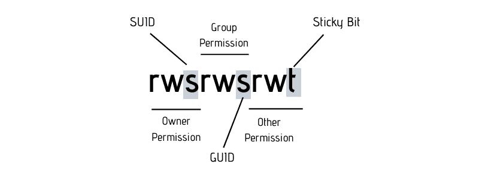

# 📝 Files

_Tutto è un file in Linux_ o quasi. Questo è un motto del mondo Linux, dove molte cose sono
modellate ed esposte con un interfaccia file-simile.

Esistono diversi tipi di file:

- `regular files`, `-`: normal files (hard links)
- `directory files`, `d`: directories
- special files:
    - `character files`, `c`: rappresentano device con cui si comunica in modo seriale
    - `block files`, `b`: rappresentano device con cui si comunica tramite blocchi di dati
    - `soft link files`, `l`: shortcut verso un altro file, ma non direttamente verso i dati
    - `socket files`, `s`: file per comunicazione fra processi, via network e non
    - `pipes files`, `p`: file per comunicazione unidirezionale fra due processi

Esistono due comandi utili per esaminare il tipo di un file:

```shell
# reports the type and some additional info about a file
$ file <path>

# list file(s) and some additional infos
$ ls -alh [file, ...] 
```

I filesystem usano gli inode per tracciare per organizzare la gerarchia del filesystem.
Un inode è una struttura dati che contiene metadati e puntatori verso altri files
(per le cartelle) e/o blocchi di dati nel device di storage (per i files).

Un file può essere rappresentato come un inode, e l’inode ai blocchi di dati (hard link).

- `hard links`: sono il numero di file che sono rappresentati dallo stesso inode. E’ possibile
  avere più hard link verso stesso inode e un file viene davvero eliminato solo quando
  l’ultimo hard link (file nel file system) è eliminato. Gli hard links funzionano solo
  all’interno dello stesso filesystem e solo per file e non directory. Hard links sono come
  file regolari, se non fosse per l'attributo numero di _hard links_. Hard links nuovi
  ereditano di default le permissions dell'originale.
- `soft links`: un file collegato non ad un inode ma ad un altro file. Permissions del soft
  link non sono importanti, contano solo quelle del file puntato. Se il file originale viene
  eliminato risultano broken links. I _soft links_ possono puntare anche a directory e
  funzionano anche fra filesystem diversi.

```shell
# create a new hard link
$ ln <path/to/orig_file> <path/to/new_hard_link>

# create a new soft link
$ ln -s <path/to/orig_file> <path/to/new_soft_link>
```

## Filesystem hierarchy

Il filesystem linux è organizzato per convenzione secondo la seguente gerarchia.

- `/home`   -> contiene le cartelle degli utenti è aliasata dal simbolo ~ (tilde)
- `/root`   -> home dell’utente root

- `/media`  -> montati filesystem di device esterni e rimuovili (es. USB)
- `/dev`    -> contiene i file speciali di tipo carattere e blocco (es. hard disk, mouse, etc)
- `/mnt`    -> filesystem montati temporaneamente

- `/opt`    -> dove vengono installati programmi di terze parti
- `/etc`    -> usata tipicamente per file di configurazione
- `/bin`    -> contiene i binari dei software di sistema
- `/lib`    -> contiene librerie (statiche e dinamiche) dei software di sistema
- `/usr`    -> contiene i binari di applicazioni degli utenti
- `/var`    -> contiene tipicamente dati scritti da applicazioni, es logs e caches

- `/tmp`    -> cartella con file e dati temporanei

## File manipulation

### Archival and compression

Il comando `tar` è usato per archiviare file e creare archivi, cioè un singolo file (definito
tarball). Il comando _ls_ supporta un flag per vedere dentro una tarball.

I files archiviati hanno come nome un path che può essere relativo o assoluto. Tale
nome/path viene generato quando viene creato l'archivio (es. se aggiungiamo directory/files
indicandoli con absolute o relative path). Quando viene estratto il file il suo nome/path
nell’archivio determina dove verranno estratti, ovvero directory corrente + path del file
nell’archivio (meglio listare il contenuto di una tarball prima di estrarla, in modo da
sapere dove i file verranno posti).

I comandi più utili sono:

```shell
# create tarball from specified files
$ tar -cf <archive.tar> <files..>

# add file to existing tarball
$ tar -rf <archive.tar> <file>

# create tarball and compress it
$ tar -zcf <archive.tar> <files..>

# look at the tarball contents
$ tar -tf <archive.tar>

# extract contents in specified directory
$ tar -xf <archive.tar> -C <output_dir>
```

Per quanta riguarda la compressione quasi tutti i sistemi Linux supportano tre utility per
per eseguirla (originale perso di default, --keep per mantenerlo):

- `gzip --keep <file>`
- `bzip2 --keep <file>`
- `xz --keep <file>`

Per quanto riguarda la decompressione (compresso perso di default). Notare che esistono
tool per eseguire lettura enza decompressione (es. `zcat`).

- `gunzip/gzip --decompress --keep <file>`
- `bunzip2/bzip2 --decompress --keep <file>`
- `unxz/xz --decompress --keep <file>`

In genere si utilizzano assieme a _tar_ poiché esso supporta anche la (de)compressione con
uno dei metodi specificati sopra. Per la decompressione automatica con tar non serve indicare
il metodo.

```shell
$ tar --create [--gzip/--bzip2/--xz] --file archive.tar.gz <file1> <file2> ...
```

### Searching & grepping

Il comando `find` cerca un file in una specifica directory. Il comando find è potente e
supporta un ricco set di flags ed opzioni, è ricorsivo di default. Ecco alcuni esempi.

```shell
# general usage pattern
$ find <root-di-ricerca> [OPTIONS]

# find directories with a specific name
$ find /home -type d -name <dir_name>
# find files with a specific name
$ find /home -type f -name <file_name>

# find files but ignore case, and use wildcards
$ find /home -iname "file.*"
# find files with given size
$ find /home -type f -size 10m
# find files whose permissions are 777 owned by the user
$ find /home -type f -perm 0777 -user <user>

# next option in OR (not AND)
$ find /home -type f -perm 0777 -o -user <user>
# negate next option
$ find /home -type f -perm 0777 -not -user <user>

# find files and for each of them exec a command
$ find /home -type f -perm 0777 -exec chmod 644 {} \;
```

Esiste anche il comando `locate` cerca un file nel filesystem, ma si base su un DB locale
creato ed aggiornato periodicamente e non sempre necessariamente aggiornato (`updatedb` per
riaggiornare).

Il comando **`grep`** è molto utilizzato per cercare pattern all’interno di files.

- `-i`    ricerca case insensitive (di default è case sensitive)
- `-r`    ricerca ricorsiva in tutti i file a partire da una root
- `-v`    ricerca per linee dove non c’è match col pattern
- `-w`    matcha solo le parole e non le substring di parole
- `-A <n>`    riporta i match e _n_ linee dopo
- `-B <n>`    riporta i match e _n_ linee prima

```shell
# general usage pattern
$ grep <options> <pattern> <files>

# grep lines starting with hello in txt files 
$ grep "^hello" *.txt
# grep lines starting with "fn" and some lines around, 
# recursive mode starting from current directory
$ grep -A 3 -B 2 -r -i "^fn" .
```

### Misc

Il comando `cut` estrae colonne da un file, specificando il delimiter e il field che ci
interessa.

```shell
$ cut -d <delimiter> -f <field_num> <path/to/file>
```

Il comando `sort` sorta le righe in ordine alfanumerico.

```shell
$ cat <file> | sort
```

Il comando `uniq` filtra righe duplicate vicine.

```shell
$ cat <file> | sort | uniq
```

Il comando `diff` mostra differenza fra due file.

```shell
#  mostra differenze e context delle differenze
$ diff -c file1 file2
# mostra differenze side by side
$ diff -y file1 file2
```

## Permissions

Ogni file ha degli attributi, di solito visibili tramite `ls -l`, nel seguente formato:
`-rwxrwxrwx`. Dove la prima lettera indica il tipo di file e le altre i permessi del file,
raggruppati per proprietario (3 bit), gruppo del proprietario (3 bit), tutti gli altri (3 bit).
Un gruppo di permessi lista cosa può fare e chi con quel file.

Un gruppo di permessi è rappresentato come 3 bit (4=read, 2=write, 1=execute, un set di
permessi può essere espresso come la somma di questi 3 bit). Lo stesso discorso di permessi
vale anche per le directory.

- `r`: leggere file o listare contenuti directory (ls)
- `w`: scrivere su file o scrivere nuovo file in directory (touch)
- `x`: eseguire file o accedere alla cartella (cd)

I permessi sono verificati sequenzialmente: utente se applicabile, gruppo se applicabile,
tutti gli altri. Non è necessario che il proprietario di un file appartenga al gruppo
proprietario di quel file. I check dei permessi sono verificati in sequenza in ogni caso.

### Change owner & group

Il comando per cambiare proprietario e/o gruppo ai file: `chown [-R] <user>[/group] file`.
Esiste anche la versione per modificare solo il gruppo: `chgrp [-R] <group> file`. Changing
the ownership (user/group) of files and directories is only allowed to root/sudoers.

```shell
# note that we changed both user and group but
# we can also change only one of the two
$ chown andrea:wheel filename.txt

# modify owner recursively
$ chown -R andrea:wheel ./some_dir
```

### Change permissions

Only the owner and root/sudoers are allowed to the change the permission of a file or
directory.

Per modificare i permessi: `chmod <permissions> <filename>`. I permessi sono specificabili
numericamente o tramite lettere evocative _<u/g/o><+/-><r/-><w/-><x/->_, anche scrivibili
come una lista separata da virgola. In alternativa esiste la sintassi numerica.

```shell
# change permissions of the file for others, add read permissions, 
# remove execute and write ones, add all for owner and group
$ chmod a+r a-wx o+rwx g+rwx binary_file

# same but with numbers (7=4+2+1=r+w+x, 4=4+0+0=r)
$ chmod 0774 binary_file
```

### Other permissions



Il `setUID` (_sUID_) se settato su un file, quando un file viene eseguito, verrà eseguito come
owner del file e non come l’utente che sta eseguendo il file. È possibile settare setUID con
`chmod 4xxx file.txt` (4 iniziale). Notare che il sUID può essere presente
anche senza l'execute permission, in tal caso verrà visualizzato con una _s_ minuscola nei
permessi di un file, altrimenti con una _S_ maiuscola (suid + x bit both present).

Il `setGID` (_sGID_) su un file, quando il file viene eseguito avendo permessi di
gruppo viene eseguito come fosse il gruppo a cui appartiene il file ad averlo lanciato. Si
può settare con il comando `chmod 2xxx file.txt` (2 iniziale).

Lo `sticky bit` on files does not affect individual files. However, at the directory level,
it restricts file deletion. Only the owner (and root/sudoers) of a file can remove the file
within that directory (letter = t, bit = 1), e.g. `chmod +t file.txt`.

I SUID, GUID, sticky bit possono essere combinati 4 + 2 + 1, e.g. _chmod 6777 file.txt_
setta sia suid e guid sul file.txt.

