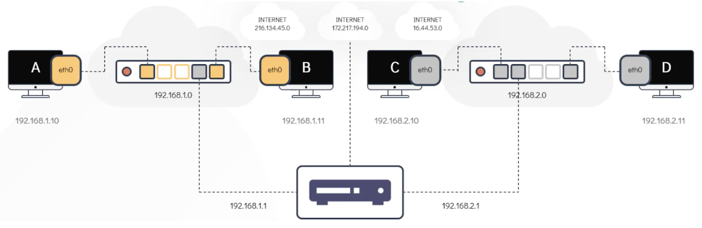
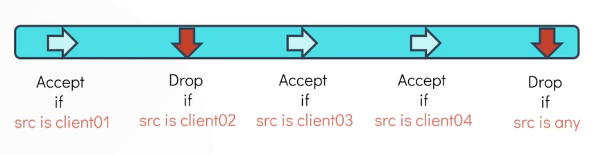

# 🌐 Network

## Switching & routing

Uno _switch_ connette più reti di livello 2, che si trovano su mezzi fisici diversi. Più
reti di livello 2 sono raggruppate in un unica rete di livello 3 (IP). Le macchine nelle reti
di livello 3 hanno un _IP_ di rete e più reti di livello 3 sono collegate tramite _routers_.

Gli switch permettono la comunicazione fra host solo all’interno della stessa rete,
mentre la comunicazione fra reti diverse passa tramite router. I router hanno più
interfacce ognuna collegata ad un network IP diverso ed ognuna con il proprio indirizzo
IP compreso nel network su cui si affaccia. I router contengono regole di routing per
inoltrare il traffico da una data interfaccia verso un’altra interfaccia, in base all’IP
di destinazione.



Le macchine Linux astraggono il link fisico (es. collegamento con switch) come `interfacce
di rete` Linux. Gli host (come i routers) possiedono una `routing table`, che controlla
dove vengono inoltrati i pacchetti in uscita in base alla destinazione. Ad esempio, se la
destinazione è un host in una delle reti IP su cui l'host ha un'interfaccia, la _routing table_
specifica che quel pacchetto debba essere inoltrato sull'interfaccia collegata a tale rete.
Gli host sono inoltre impostati per avere un `default gateway`. Si tratta dell'IP "di default"
a cui viene mandato il traffico quando la routing table non ha match migliori per l'IP di
destinazione.

Il comando 🛠️`ip` viene utilizzato per gestire le interfacce di rete Linux.

```shell
# modifica o lista le interfacce dell’host
$ ip link
```

Per modificare gli IP assegnati alle interfacce si usa `ip addr add <args>`. Ad esempio è
possibile assegnare a una interfaccia l’IP fornito (deve essere nel network range indicato),
in modo che l'host possa comunicare all'interno del network. Notare che però tipicamente gli
IP vengono assegnati automaticamente tramite protocol `DHCP` dal DHCP server.

```shell
# assegna IP ad una interfaccia
$ ip addr add <ip>/<netmask> dev <interfaccia>
```

Con `ip route` è possibile gestire la routing table e le sue entries.

```shell
# mostra la routing table dell'host
$ ip route

# configura una route nella routing table 
# (ip-gateway is typically the router)
$ ip route add  <net_ip>/<net_mask> via <ip-gateway>

# configura il default gateway
$ ip route add default via <ip-default-gateway>
# equivalente a 
$ ip route add 0.0.0.0 via <ip-default-gateway>
```

Le modifiche fatte alle interfacce o alla tabella di routing sono temporanee, a meno che non
venga modificato il file di configurazione 📄`/etc/network/interfaces`.

## Diagnostics

Il comando 🛠️`ping` manda un pacchetto ICMP ad un dato IP e si aspetta una risposta,
monitorando anche diverse metriche. Usato tipicamente per troubleshooting e per verificare la
connettività (routing corretto, interfaces funzionanti, etc).

Il comando 🛠️`traceroute` segue il percorso di un pacchetto dalla sua sorgente fino a
destinazione, riportando problemi e metriche. Permette di verificare problemi di routing,
colli di bottiglia ed altro.

Possible troubleshooting flow:

- verificare interfacce della macchina da cui facciamo il test o da cui si manifesta il
  problema
- verificare IP ed interfaccie degli host destinatari
- verificare la risoluzione corretta dell'eventuale nome di dominio (`dig`)
- verifica connettività del newtork (`ping`), in caso si mancata connettività `traceroute`
  può veririfcare dove l’invio dei messaggi si ferma e da li è possibile fare ulteriori
  indagini
- controllare processi che dovrebbero essere in ascolto sul server

## DNS

### Configuration

Il file 📄`/etc/hosts` è una lista locale di associazioni nomi -> ip. Il file viene spesso
consultato prima dei server di DNS per risolvere un dominio, a meno che la macchina non
sia impostata diversamente. Molti tool adottano questo metodo fra cui _curl_ ed _ssh_.

Gestire manualmente il file `/etc/hosts` per reti grandi e/o mutevoli è scomodo ed error
prone, si preferisce quindi impostare l'utilizzo diretto di un server DNS da parte della
macchine. Per puntare gli host verso il corretto server DNS si modifica il file
📄`/etc/resolv.conf`, indicando l’IP del nameserver. Il file `/etc/hosts` è solitamente ancora
usato con priorità maggiore (di default, ma dipende ta tool a tool). La priorità è
modificabile editando il file 📄`/etc/nssswitch.conf`.

Riassumendo:

- `/etc/hosts`: file con nomi di dominio e relativo ip, consultato da vari comandi e tools
  per tentare di risolvere un nome di dominio
- `/etc/resolv.conf`: lista di nameserver consultabili dalla macchina
- `/etc/nssswitch.conf`: elenca la priorità fra: la consultazione di _/etc/hosts_ e
  l'interrogazione di un nameserver impostato in _/etc/resolv.conf_

```shell
$ cat /etc/hosts

# mappings from names to ip
127.0.0.1	localhost
::1         localhost
10.2.4.128  database db
```

```shell
$ /etc/resolv.conf

# list of nameserver
search example.com local.test
nameserver 10.0.0.17
nameserver 10.1.0.12
nameserver 10.16.0.7
```

```shell
$ /etc/nssswitch.conf

# priority for host resolution, ignore other rows
hosts:          files dns
```

### Resolution process

Come già indicato il file `/etc/hosts` può essere usato dalle macchine Linux per la risoluzione
di nomi, con più o meno priorità rispetto ai nameservers. Nel caso di utilizzo di nameservers
spesso viene utilizzato un nameserver locale.

Il server DNS che viene usato tipicamente ha una lista configurata di nomi, che possono
essere quindi risolti su richiesta dei clients. Se richiediamo la risoluzione di un nome
non presente nel database del nameserver possono accadere una delle due segeunti cose:

- il DNS server è anche un _resolver_, per cui autonomamente si occuperà di risolvere il nome
  ricorsivamente attraverso il sistema DNS pubblico. Il DNS server deve essere impostato per
  contattare il giusto nameserver esterno
- i client sono configurati per avere un secondo nameserver (es. 8.8.8.8) da contattare nel
  caso il DNS server locale non abbia la risposta cercata (è possibile specificare più di un
  DNS server in `/etc/resolv.conf`)

Il DNS server locale ha di solito precedenza su DNS server pubblici.

Nel primo caso (nameserver locale che è anche resolver) una tipica richiesta ha questo
flow: il client contatta il server DNS locale, se il server locale non ha una risposta esso
effettua una risoluzione ricorsiva attraverso il DNS pubblico di internet a partire dai root
nameservers. Infine si giunge al nameserver autoritativo per il nome cercato. Le risposte
sono cachate anche su più livelli (TTL dei records DNS).

I comandi 🛠️`dig` e 🛠️`nslookup` fanno risoluzione di nomi (senza considerare il file
`/etc/hosts`).

```shell
# resolution of google.com
$ dig google.com

# resolve google.com without retries, asking 
# to the nameserver at 8.8.8.8 port 53
$ dig +retry=0 -p 53 @8.8.8.8 google.com

# resolve google.com without retries, perform and 
# show the entire recursion from the root servers
$ dig +retry=0 +trace +recurse www.google.com 
```

## Iptables (firewalls & more)

E’ utile sapere come gestire la sicurezza di rete tramite firewall. E’ possibile farlo
direttamente sui router oppure sui singoli server. Il tool 🛠️`iptables` permette di
controllare e gestire il traffico di rete su una singola macchina.

iptables controlla il traffico tramite _chains_ (o _catene di regole_). La chain `INPUT` è
applicabile al traffico in ingresso, la chain `OUTPUT` è responsabile per il traffico generato
dal server in uscita, mentre la chain `FORWARD` è responsabile del forwarding ovvero quando il
traffico in ingresso deve essere reindirizzato in uscita. Iptables inoltre presenta più
tabelle, ognuna con un suo scopo (_nat_, _raw_, _mangle_, _filter_, etc) ognuna con le sue
chain di regole. Noi qua parleremo solo di quella _filter_.

Il nome _chain_ deriva dal fatto che è una _chain of rules_. Ogni regola di una chain cerca di
matchare il pacchetto in esame e lo droppa o accetta (o altra azione), se non c’è match con la
regola si passa alla regola successiva. Ad esempio, nella figura sottostante, un pacchetto da
proveniente dal _client01_ matcha alla prima regola e il pacchetto è direttamente accettato. Se
un pacchetto arriva da _client09_ solo la quinta regola viene applicata perchè le precedenti
non matchano. E’ ovviamente possibile matchare su molte caratteristiche.



Se un pacchetto non matcha nessuna regola l’azione intrapresa dipende dalla policy di default
applicata alla chain (visualizzabile con `iptables -L`). È possibile impostare la politica
predefinita utilizzando il flag _-P_.

### Example

Cerchiamo di creare delle regole _iptables_ per lo scenario mostrato qui sotto, mostriamo
quelle per la macchina _devapp01_. Notare che è importante aggiungere le regole nel
**giusto ordine** poichè le regole vengono matchate in ordine, dalla prima all’ultima.


```shell
# INPUT default policy: ACCEPT

# aggiunge regola che accetta i pacchetti provenienti 
# dal client, solo pacchetti TCP sulla porta 22
$ iptables -A INPUT -p TCP -s 172.16.238.187 --dport 22 -j ACCEPT

# accetta il traffico uscente TCP verso l’IP specificato 
# (db host), porta di destinazione 80 
$ iptables -A OUTPUT -p tcp -d 172.16.238.11 --dport 5432 -j ACCEPT

# accetta il traffico uscente TCP verso l’IP specificato 
# (git repo), porta di destinazione 80
$ iptables -A OUTPUT -p tcp -d 172.16.238.15 --dport 80 -j ACCEPT

# droppa il traffico TCP verso tutte le destinazioni, porta di 
# destinazione 443 o 80 (blocco internet)
$ iptables -A OUTPUT -p tcp --dport 443 -j DROP
$ iptables -A OUTPUT - tcp --dport 80 -j DROP

# accetta il traffico TCP entrante dall’IP specificato (client) 
# sulla porta 80 (http)
$ iptables -A INPUT -p tcp -s 172.16.238.187 --dport 80 -j ACCEPT

# aggiunge regola (catch-all) che droppa tutto il traffico TCP
# entrante sulla porta 22, deve essere messa in fondo alla chain
$ iptables -A INPUT -p TCP --dport 22 -j DROP 
```

Iptables presenta molti comandi, listarli tutti è impossibile, ma ecco alcuni esempi:

```shell
# lista le regole di networking del sistema
$ iptables -L 

# elimina la regola in posizione 5 nella chain OUTPUT
$ iptables -D OUTPUT 5 
```

#### References

- https://www.digitalocean.com/community/tutorials/a-deep-dive-into-iptables-and-netfilter-architecture
- https://unix.stackexchange.com/questions/189905/how-iptables-tables-and-chains-are-traversed
- https://linux.die.net/man/8/iptables