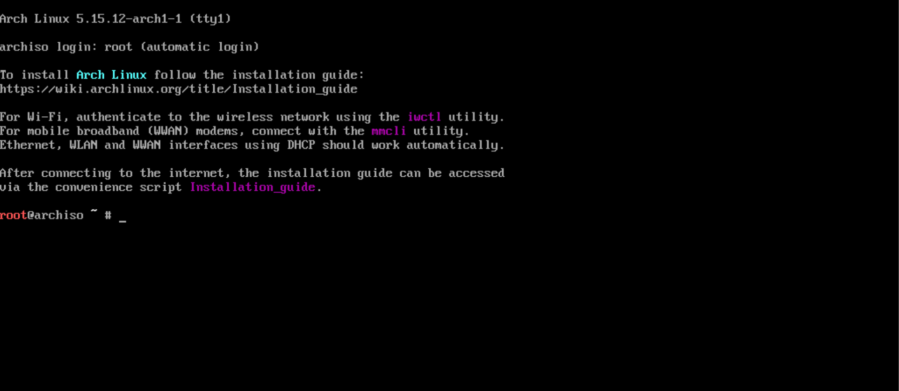
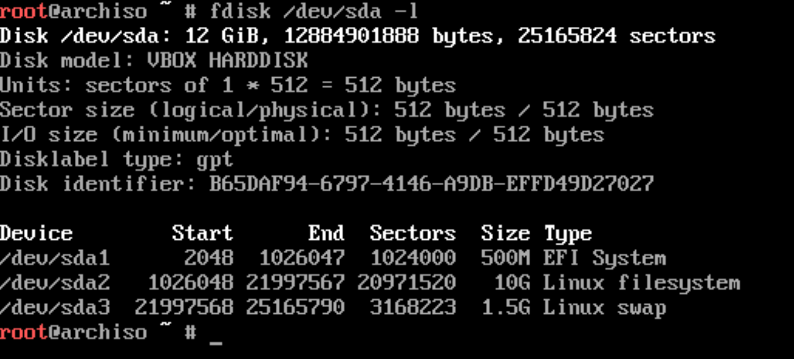

# Pre-installation

## Create bootable media with the OS image

To download Arch Linux, head to https://archlinux.org/download/ and download the latest release (~800MB).
Once downloaded you need to put the image on a USB, you can use different tools on MacOS and Windows, like
Balena Etcher, WonderISO, Fedora Media Writer, etc. Choose one and proceed.

From your UEFI screen disable secure boot (we can re-enable it later). On some systems secure boot could
disallow Arch Linux to boot properly. If you are creating a dual boot system (e.g. Windows + Linux) it is
important to disable fast startup and hibernation features on Windows.


## Boot from installation medium

Plug the USB, turn on the machine and access the BIOS firmware UI (it is done in different ways depending
on the specific hardware configuration). From there pick the bootable USB drive as the device to boot from.
The installation process will ask you confirmation for OS installation, proceed and wait the Arch Linux
installer to boot. If everything works as expected you should see the terminal in a screen like the one
showed below. The Arch installer doesn't have any graphical user interface to automate the installation.



Make sure that you've booted in UEFI mode and not in BIOS mode. The following command will output a bunch 
of UEFI related files if the boot started in UEFI mode properly. In case of a BIOS boot, the _efi_ directory
won't even exist inside the `/sys/firmware` directory.
````shell
$ ls /sys/firmware/efi/efivars
````

By default, the console assumes that you have a standard US keyboard layout. You can change the layout
to a different one. All the available keymaps are usually kept inside the `/usr/share/kbd/keymaps` directory
in the form of map.gz files.
```shell
$ ls /usr/share/kbd/keymaps/**/*.map.gz
```

Choose the keyboard layout you prefer, load it and save the change with the `loadkeys` command.
```shell
# <layout> is the name of a layout found in/usr/share/kbd/keymaps/**/*.map.gz
# without the map.gz extension
$ loadkeys <layout> 
```

### Network connection
Before proceeding, we must connect to internet in our USB installation environment.

If you're using a wired network you could have a working internet connection already working. 
To test it out, ping any public addresses. If you have a wireless connection you have to configure 
it manually. The live environment comes with the iwd or iNet wireless daemon package. You can use 
this package to connect to a nearby wireless network.

```shell
# starts an interactive CLI
$ iwctl 
  # list wifi cards/devices in your machine (e.g. wlan0)
  > device list
  # scan wifi networks using that wifi card
  > station <device> scan
  > station <device> get-networks
  # connect to the network you choose, the 
  # CLI should ask you for credentials
  > station <device> connect <SSID>
  # if all good, exit from the CLI
  > exit
  
# check everything works correctly
$ ping 8.8.8.8
```

Finally sync the machine clock:
```shell
$ timedatectl set-ntp true
```

## Disk partitioning
Disk partitioning is dangerous if you don't know what you are doing, if you mess up your partitions, you lose 
data on your disks. So keep attention!

Start with `lsblk` or `fdisk` to obtain information about the current disks and partitioning. We will go with 
the second option. List the partition tables for all the available devices on your computer. Ignore any device 
not related to physical disks and consider only those (should be named like e.g. _/dev/sda_, _/dev/nvme0n1_, 
etc. depending on your hardware). Remember: these files under _/dev_ represent devices/pieces of hardware connected
to your machine and exposed as block files (block for disks).

```shell
$ fdisk -l
```

Choose a disk to install the OS, take note of the corresponding block file under /dev and inspect the disk 
and its partitions. The command will output the partition table for the device. Partitions are usually named 
after the name of the disk, so if you have _/dev/nvme0n1_ as a disk name, partitions are named _/dev/nvme0n1p1_,
_/dev/nvme0n1p2_, etc.

```shell
$ fdisk </path/to/your/device/file> -l
```

Once you collect all useful information, use `gdisk` to start re-partitioning the disk (`gdisk`
is the user-friendly version of `fdisk`, it uses an interactive CLI). You really want to have 
a GPT partitioned disk, MBR is considered legacy and must be avoided.

You need at least three partitions to install Arch Linux:

| Partition            | Usage                                                       | Space   | Type             | Filesystem to use |
|:---------------------|:------------------------------------------------------------|:--------|:-----------------|:------------------|
| EFI system partition | used to store files required by the UEFI firmware           | 500MB   | EFI              | FAT32             | 
| ROOT partition       | for installing the distribution itself and store user files | > 100GB | Linux filesystem | EXT4              |
| SWAP partition       | space dedicated for swapping (overflow space for your RAM)  | 10GB    | Linux swap       |                   |

Note that if you are creating a dual boot setup some partitions could be already present. You don't want 
to touch partitions dedicated to other OS. Also note that in this case the EFI partitions is already present
since it's shared between multiple installed OS. Don't touch that, just create the other partitions and move on.

```shell
# start the gdisk CLI
$ gdisk </path/to/your/device/file>
  ### GDISK COMMANDS 
  # show help and commands
  > ?
  # list current partitions on disk
  > p 
  # create new partition, it will ask first and last sector so the
  # size of the partition will be (last sector - first sector)
  # OR you can input the first sector and the size directly as the 
  # last sector field e.g. +100G
  > n
  # show type of partitions, then choose appropriate value
  # (EFI type, Linux filesystem, etc)
  > l
  # confirm partitions creation and exit
  > w
  
  ### PARTITIONS CREATION
  # create EFI partition, size = +500M, type code = ef00 
  > n 
  # create ROOT partition, size = +100G, type code = 8300 
  > n 
  # create EFI partition, size = +10G, type code = 8200 
  > n
  # check everything is correct, then write and exit 
  > p
  > w
```

After writing the partitions check again everything worked as expected. Take note of the partition 
device names (e.g. _/dev/nvme0n1p1_, _/dev/nvme0n1p2_, etc.), you must refer to them in the next step.

```shell
$ fdisk /dev/sda -l
```



## Filesystems and mount points

Partitioning by itself is not enough for the OS to use the partitions. We need to format the 
partitions. To do this we must create a filesystem on each partition. A file system is a 
standard that defined how files and data are stored and organized on disk. The most popular 
Linux filesystems are _ext3_ and _ext4_. The filesystem is a feature of a partition, recorded
along with the partitions themselves in the partition table, therefore they are used to 
indicate how to interpret/manage partitions to the OS.

The EFI partition should be formatted with a FAT32 filesystem. It is a standard for EFI partitions and 
all OS rely on this to read the EFI partition.

```shell
# format the EFI partition with a FAT32 filesystem
# <path/to/the/partition/device> is not the disk itself (/dev/nvme0n1), but
# the device file referring to the EFI partition (e.g. /dev/nvme0n1p1)
$ mkfs.fat -F32 <path/to/the/EFI_partition/file>

# format the ROOT partition with a EXT4 filesystem
$ mkfs.ext4 <path/to/the/ROOT_partition/file>

# format the SWAP partition
$ mkswap <path/to/the/SWAP_partition/file>
```

⚠️ TO CHECK ⚠️ 
Note that now we are operating inside the Arch Linux Live Environment and the filesystem rooted 
at `/` contains the files loaded from the USB installation medium. This filesystem is not really 
backed by the USB storage, but is simulated on the RAM (this is how live installations works). 
Writing/modifying files in the current filesystem will not result in permanent modifications 
of the USB contents. So the files we can visualize (until the end of the current installation 
step) are files of an Arch Linux system, but in RAM and loaded from the USB Live image. ⚠️

We need now to mount our disk partitions on the filesystem, following the table below. The _/mnt_ 
directory is generally used for temporary mounts so it's fine to use it now. Note that in the 
final installation ROOT and EFI partitions will be mounted on proper locations.

| Partition            | Filesystem     | Temporary mount point | 
|:---------------------|:---------------|:----------------------|
| ROOT partition       | EXT4           | /mnt                  |
| EFI system partition | FAT32          | /mnt/boot             |
| SWAP partition       | -              | -                     |


```shell
# mount the ROOT partition on the file system
$ mount --mkdir /dev/<ROOT_partition_file> /mnt

# mount the EFI partition on the file system
$ mount --mkdir /dev/<EFI_partition_file> /mnt/boot

# don't mount the SWAP partition, just tell Linux to use it
$ swapon /dev/<SWAP_partition_file>
```

## Configure mirror servers

At this point we have some partitions on one or more disks, properly formatted and temporarily 
mounted. We need now to configure the mirrors to download Arch Linux packages. The installer
comes with `Reflector`, a script written to retrieve the latest mirror list from the Arch Linux
Mirror Status page.

Reflector can generate a list of mirrors based on a set of requirements. In this cas, I want a list
of mirrors that were synchronized within the last 12 hours and that are located in Italy (you should
use your country), and sort the mirrors by download speed. The save command will persist the result
in the specified file. You can run the reflector without saving the output just to see what the script
produces (the list of mirrors).

The file at `/etc/pacman.d/mirrorlist` is a configuration file used by pacman to know which mirrors
to use (in descending order of preference). Now when we'll install Arch Linux in the next steps, 
the OS and all packages will be downloaded from the mirrors indicated there.

```bash
$ reflector \
  --download-timeout 60 \
  --country Italy \
  --age 12 \
  --protocol https \
  --sort rate \
  --save /etc/pacman.d/mirrorlist
```


# Installation

## Install OS

First of all let's update packages of the Live OS.

```shell
$ pacman -Sy
```

Once the update process is finished, you can use the `pacstrap` script to install the Arch 
Linux system. The `pacstrap` script can install packages to a specified new root directory 
(`/mnt`). As you may remember, the root partition was mounted on the `/mnt`mount point, so 
that's what you'll use with this script.

```shell
$ pacstrap /mnt \ 
    # the linux kernel and most
    # common linux firmwares
    linux \
    linux-firmware \  
    # minimal package set to define a 
    # basic Arch Linux installation
    base \
    # C compiler & dev utilities
    gcc \
    git \
    make \
    vim \
    docker \
    
    # utilities, commands and tools
    sudo \         
    networkmanager
```

Now the Linux kernel is installed along with some utilities (in the temporary mounted disk
partition), but it's not enough. We need to configure some more things to have a proper 
running system.

### Configure partitions mounts at boot

We manually mounted partitions into the file system, but these mounts are not yet permanent.
The `/mnt/etc/fstab` file can be used to define how disk partitions, various other block
devices, or remote file systems should be mounted into the file system at boot.

The `genstab` script simply detects all the current mounts below a given mount point and
prints them in fstab-compatible format to standard output. We can redirect the output to  
the `/mnt/etc/fstab` file, so the OS will re-mount all the partitions at boot.

```shell
$ genfstab -U /mnt >> /mnt/etc/fstab
```

Double-check the `/mnt/etc/fstab` file. If everything looks good, we can proceed.

### Change root to new root partition

From here, it is convenient to change root inside the new root partitions (where the new OS
is installed) and run the commands inside the chroot (called also _root jail_).

A `chroot` on Unix and Unix-like operating systems is an operation that changes the apparent
root directory for the current running process and its children. A program that is run in such
a modified environment cannot name (and therefore normally cannot access) files outside the
designated directory tree. The term _chroot_ may refer to the _chroot system call_ or the
_chroot wrapper program_. The modified environment is called a _chroot jail_.

```shell
$ arch-chroot /mnt
```


## Install the boot loader (GRUB)

### Introduction

A short recap of the boot process under UEFI before installing the GRUB boot loader. Below
there's the output of the `efibootmgr` command. It shows the boot entries saved in the machine
NVRAM (where boot entries are stored in hardware).

```shell
$ efibootmgr -v
  BootCurrent: 0002
  Timeout: 3 seconds
  BootOrder: 0003,0002,0000,0004        # order in which the entries in the list will be tried.
  Boot0000* CD/DVD Drive  BIOS(3,0,00)
  Boot0001* Hard Drive    HD(2,0,00)
  Boot0002* Fedora        HD(1,800,61800,6d98f360-cb3e-4727-8fed-5ce0c040365d)File(\EFI\fedora\grubx64.efi)
  Boot0003* opensuse      HD(1,800,61800,6d98f360-cb3e-4727-8fed-5ce0c040365d)File(\EFI\opensuse\grubx64.efi)
  Boot0004* Hard Drive    BIOS(2,0,00)P0: ST1500DM003-9YN16G
```

Under the UEFI firmware, the boot process looks like this:
- the system is switched on, the power-on self-test (POST) is executed
- after POST, the UEFI firmware initializes the hardware required for booting (disk,
  keyboard, etc.)
- the firmware reads the boot entries in the NVRAM to determine which EFI application are
  present and which to launch and from where (from which disk and partition)
- boot entries can be of one of this type:

  - _simply a disk (BIOS compatibility)_: BIOS compatible booting mechanism, in the example
    below boot entries 0000 and 0004

  - _fallback UEFI boot entries_: for those, the firmware will look through each EFI system
    partition on the disk in the order they exist on the disk. Within the ESP, it will look
    for a file with a specific name and location. Example: on an x86-64 PC, it will look for
    the file `\EFI\BOOT\BOOTx64.EFI`. This mechanism is not designed for booting permanently
    installed OSes. It's more designed for booting hot-pluggable, device-agnostic media, like
    live images and OS install media. In the example below boot entry 0001

  - _full UEFI native boot entries_: typical entries for operating systems permanently
    installed to permanent storage devices. These entries show us the full power of the UEFI
    boot mechanism, by not just saying "boot from this disk", but "boot this specific
    bootloader in this specific location on this specific disk". In the example below boot
    entries 0002 and 0003

- the firmware launches the EFI application: this could be a boot loader or the Arch kernel
  itself using EFISTUB, it could be some other EFI application such as the UEFI shell or a
  boot manager like systemd-boot or rEFInd.


The UEFI native mechanism is the one to preferably adopt when installing a OS. Operating
systems should make themselves available for booting in this way: the OS is intended to
install a bootloader which loads the OS kernel, in an EFI system partition, and add an entry
to the UEFI boot manager configuration with a proper name and the location of the bootloader
(in EFI executable format) that is could be used to load that operating system.

More info about the UEFI boot process:
https://www.happyassassin.net/posts/2014/01/25/uefi-boot-how-does-that-actually-work-then/

### Update CPU microcode

⚠️ Inside the _chroot_ at the mount point of the root partition (`/mnt/`).

Processors may have faulty behaviour, which the kernel can correct by updating the microcode
on startup. Processor manufacturers release stability and security updates to the processor
microcode. These updates provide bug fixes that can be critical to the stability of your system.

```shell
# for amd processors
$ pacman -S amd-ucode
# for intel processors
$ pacman -S intel-ucode
```

### Installation

⚠️ Inside the _chroot_ at the mount point of the root partition (`/mnt/`).

Let's proceed with the installation. First, install the packages `grub` and `efibootmgr`:
GRUB is the bootloader itself while `efibootmgr` is used by the GRUB installation script
(or by us) to write boot entries to NVRAM.

```shell
$ pacman -S grub efibootmgr
```

We need to mount the EFI partition (if not already mounted previously) on `/mnt/boot` if we
are outside the _chroot_ or `/boot` if we are inside or we already logged in the newly
created OS (somehow). The following commands assume we are inside the _chroot_. If for some
reason it is necessary to run grub-install from outside of the installed system, append the
_--boot-directory=_ option with the path to the mounted _/boot_ directory, e.g
_--boot-directory=/mnt/boot_.

Remember to use the correct disk and partition here, since we need a specific filesystem type
(FAT32) to install the boot loader into.

After mounting the partition, execute the `grub-install` command to install the GRUB EFI
application _grubx64.efi_ to `${ESP}/EFI/GRUB/` and install its modules to
`${ESP}/grub/x86_64-efi/`.

```shell
# mount EFI partition if not already mounted
ESP="/boot"
$ mount --mkdir /dev/<efi_system_partition> ${ESP}

# install grub
$ grub-install \
    --target=x86_64-efi \
    --bootloader-id=arch-<your-name> \
    --efi-directory=${ESP}
```

The `grub-install` command also tries to create an entry in the firmware boot manager, named
`arch-<your-name>` in the above example. This can fail if your boot entries are full; use
`efibootmgr` to remove unnecessary entries.

Finally we generate configuration files for GRUB. Use the `grub-mkconfig` command to generate
the GRUB configuration file and saves it to a given target location. In this case
`/boot/grub/grub.cfg` is the target location.

```shell
$ grub-mkconfig -o /boot/grub/grub.cfg
```


## OS configuration

### Configure time zone

⚠️ Inside the _chroot_ at the mount point of the root partition (`/mnt/`).

List the available timezones then choose the correct one creating a symbolic link.

```shell
$ ls -alh /usr/share/zoneinfo
$ ln -sf /usr/share/zoneinfo/<region>/<city> /etc/localtime
$ hwclock --systohc # generate /etc/adjtime
```

### Configure languages

⚠️ Inside the _chroot_ at the mount point of the root partition (`/mnt/`).

First, you'll have to edit the `etc/locale.gen` file according to your localization. Open the 
file in a text editor and uncomment the locale you want to use. Then run the `locale-gen` 
command that will read your `/etc/locale.gen` file and generate the locales accordingly.

```shell
# uncomment languages chosen
$ vim /etc/locale.gen 
# generate and save locale files
$ locale-gen
```

Now that you've enabled multiple languages, you'll have to tell Arch Linux which one to use by 
default. To do so, open the `/etc/locale.conf` file and add the following line to it, modified
accordingly based on the language chosen.

```shell
$ touch /etc/locale.conf
$ echo "LANG=en_US.UTF-8" > /etc/locale.conf 
$ cat /etc/locale.conf
LANG=en_US.UTF-8
```

You can always go back to the `/etc/locale.gen` file and add or remove languages from it and 
run again `locale-gen`.

If you've made any changes to your console keymaps in the first step of installation, you may 
want to persist them now. To do so, open the `/etc/vconsole.conf` file and add your preferred 
keymaps there.

```shell
$ touch /etc/vconsole.conf
$ echo "KEYMAP=it" > /etc/vconsole.conf 
$ cat /etc/vconsole.conf
KEYMAP=it
```

### Configure basic networking

⚠️ Inside the _chroot_ at the mount point of the root partition (`/mnt/`).

I use the `networkmanager` package to handle connection, because it is easier to use 
and implements different functionalities in one place. Alternatively there are different
options. Personally I tried with `wpa_supplicant` + `dhcp_client` to connect to a wi-fi
access point and handle IP assignation via DHCP.

```shell
# install the package if not done previously
$ pacman -S networkmanager
# enable it as a systemd unit, and disable other 
# network related tools that could interfere
$ systemctl stop wpa_supplicant
$ systemctl disable wpa_supplicant
$ systemctl enable NetworkManager
```

We need also to configure the host name for this machine, modifying the `/etc/hostname` file.
I usually use my machine model + my name as my hostname. Additionally it's a good thing to 
modify the `/etc/hosts` file to provide some DNS records. 

```shell
$ cat /etc/hostname
andrea-<machine>

$ cat /etc/hosts
127.0.0.1        localhost
::1              localhost
127.0.1.1        andrea-<machine>
```

### Change root user password

⚠️ Inside the _chroot_ at the mount point of the root partition (`/mnt/`).

The passwd command lets you change the password for a user. By default it affects the current 
user's password which is the root right now. Do it and follow the prompt.

```shell
$ passwd
```

### Add non-root user

⚠️ Inside the _chroot_ at the mount point of the root partition (`/mnt/`).

The installation leaves by default only one user: the root superuser. Using your Linux system 
as the root user for long is not a good idea. So creating a non-root user is important. The 
`wheel` group is the administration group, commonly used to give privileges to perform 
administrative actions. Create a new user and change its password.

```shell
# -m = add corresponding home directory
# -G = add to indicated group 
$ useradd -m -G wheel <username>

# change password for newly created user
$ passwd <username>
```

If not already present add administration privileges for the new user. Open `/etc/sudoers` and 
uncomment the following line. 

```shell
$ vim /etc/sudoers
# uncomment this
%wheel ALL=(ALL) ALL
```

Some more info on how `sudo` and its configuration file works: 
https://www.digitalocean.com/community/tutorials/how-to-edit-the-sudoers-file


## End
Congratulations, you now have a working Arch Linux installation. At this point, you can exit
the Arch-Chroot environment, unmount the partition, and reboot.# Post installation## Network

### Wireless connection

At this point the system should have the wpa_supplicant package (`wpa_supplicant`, `wpa_cli`, `wpa_passphrase`, to 
connect and authenticate to a wireless access point, provided by the base arch installation), `dhcpcd` (dhcp client,
installed previously).

Check if the driver for your card has been loaded, check the output of the `lspci -k` or `lsusb -v`, something 
similar should appear in the drivers list:
```shell
$ lspci -k
# 06:00.0 Network controller: Intel Corporation WiFi Link 5100
#  	Subsystem: Intel Corporation WiFi Link 5100 AGN
#  	Kernel driver in use: iwlwifi
# 	Kernel modules: iwlwifi
```

Check if a corresponding network interface was created, usually the naming of the wireless network interfaces starts 
with the letter "w", e.g. wlan0 or wlp2s0:
```shell
$ ip link show
# <your-interface>: <BROADCAST,MULTICAST,UP,LOWER_UP> mtu 1500 qdisc mq state DOWN mode DORMANT qlen 1000
#    link/ether 00:60:64:37:4a:30 brd ff:ff:ff:ff:ff:ff
```

Then the network interface should be brought up with:
```shell
$ ip link set <your-interface> up
```

Check again the interface status to spot the UP keyword at the beginning of the row with `ip link`:
```shell
$ ip link show
#                                        here
#                                        | 
# <your-interface>: <BROADCAST,MULTICAST,UP,LOWER_UP> ....
```

Create the `/etc/wpa_supplicant/wpa_supplicant-<your-interface>.conf` file with the following content. This will allow
_wpa_cli_ to update the config file when needed:
```bash
$ touch /etc/wpa_supplicant/wpa_supplicant-<your-interface>.conf
```
```markdown
ctrl_interface=/run/wpa_supplicant
update_config=1
```

Now start `wpa_supplicant` on the right network interface with:
```shell
$ wpa_supplicant -B -i <your-interface> -c /etc/wpa_supplicant/wpa_supplicant-<your-interface>.conf
```

Now `wpa_cli` can be started and used to configure the connection:
```shell
$ wpa_cli

# scan the wireless networks
> scan
> scan_results
# to associate with <my-ssid>, add the network, set the credentials and enable it
> add_network
0
> set_network 0 ssid "<my-ssid>"
> set_network 0 psk "<passphrase>"
> enable_network 0
# check for something like:
# <2>CTRL-EVENT-CONNECTED - Connection to 00:00:00:00:00:00 completed (reauth) [id=0 id_str=]

# now save the config to the file previously created
> save_config
# OK
> quit
```

The file `/etc/wpa_supplicant/wpa_supplicant_<your-interface>.conf` should have been updated with a network block 
for that wireless network. The network interface should be UP in both places in the output of the `ip link` command:
```shell
$ ip link show
#                                        here                                 here
#                                        |                                    |
# <your-interface>: <BROADCAST,MULTICAST,UP,LOWER_UP> mtu 1500 qdisc mq state UP mode DORMANT qlen 1000
#   link/ether 00:60:64:37:4a:30 brd ff:ff:ff:ff:ff:ff
```

Now your network card/something is connected and authenticated to the wireless network, but you don't have an IP yet,
nor a valid route in the routing table or DNS servers set. The fastest way to this is to use a DHCP client as follows:
```shell
$ dhcpcd <your-interface>
```

### Wireless connection at boot

Several systemd units are provided from both `wpa_supplicant` and `dhcpcd` to automate connection at boot.

For `wpa_supplicant` the unit _wpa_supplicant@interface.service_ accepts the interface name as an argument 
and starts the _wpa_supplicant_ daemon for this interface. It reads a `/etc/wpa_supplicant/wpa_supplicant-<your-interface>.conf` 
configuration file (created previously if the steps above are followed)

Copy the template file and enable it (it could be in different places based on your system, but this should work):
```shell
$ cp /usr/lib/systemd/system/wpa_supplicant@.service /usr/lib/systemd/system/wpa_supplicant@<your-interface>.service
$ systemctl enable wpa_supplicant@<your-interface>
```

For the DHCP client is even easier, just enable the _dhcpcd_ systemd unit. Note that in some cases it could be necessary
to create and activate an interface-specific unit (template at /usr/lib/systemd/system/dhcp@.service_).  
```shell
$ systemctl enable dhcpcd
```

Reboot and check if everything works.