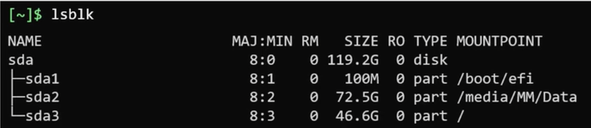

# ⚙️ Pre-installation

## Create bootable media with the OS image

To download Arch Linux, head to https://archlinux.org/download/ and download the latest release
(~800MB). Once downloaded you need to put the image on a USB, you can use different tools on 
MacOS and Windows, like Balena Etcher, WonderISO, Fedora Media Writer, etc. Choose one and 
proceed.

From your UEFI screen disable secure boot (we can re-enable it later). On some systems secure 
boot could disallow Arch Linux to boot properly. If you are creating a dual boot system (e.g.
Windows + Linux) it is important to disable fast startup and hibernation features on Windows.


## Boot from installation medium

Plug the USB, turn on the machine and access the BIOS firmware UI (it is done in different ways 
depending on the specific hardware configuration). From there pick the bootable USB drive as 
the device to boot from. The installation process will ask you confirmation for OS 
installation, proceed and wait the Arch Linux installer to boot. If everything works as 
expected you should see the terminal in a screen like the one showed below. The Arch installer
doesn't have any graphical user interface to automate the installation.


Make sure that you've booted in UEFI mode and not in BIOS mode. The following command will 
output a bunch of UEFI related files if the boot started in UEFI mode properly. In case of a 
BIOS boot, the _efi_ directory won't even exist inside the `/sys/firmware` directory.

````shell
$ ls /sys/firmware/efi/efivars
````

By default, the console assumes that you have a standard US keyboard layout. You can change 
the layout to a different one. All the available keymaps are usually kept inside the 
`/usr/share/kbd/keymaps` directory in the form of map.gz files.
```shell
$ ls /usr/share/kbd/keymaps/**/*.map.gz
```

Choose the keyboard layout you prefer, load it and save the change with the `loadkeys` command.
```shell
# <layout> is the name of a layout found in/usr/share/kbd/keymaps/**/*.map.gz
# without the map.gz extension
$ loadkeys <layout> 
```

### Network connection
Before proceeding, we must connect to internet in our USB installation environment.

If you're using a wired network you could have a working internet connection already working. 
To test it out, ping any public addresses. If you have a wireless connection you have to 
configure it manually. The live environment comes with the iwd or iNet wireless daemon 
package. You can use this package to connect to a nearby wireless network.

```shell
# starts an interactive CLI
$ iwctl 
  # list wifi cards/devices in your machine (e.g. wlan0)
  > device list
  # scan wifi networks using that wifi card
  > station <device> scan
  > station <device> get-networks
  # connect to the network you choose, the 
  # CLI should ask you for credentials
  > station <device> connect <SSID>
  # if all good, exit from the CLI
  > exit
  
# check everything works correctly
$ ping 8.8.8.8
```

Finally sync the machine clock using the NTP time protocol:
```shell
$ timedatectl set-ntp true
```

## Disk partitioning
Disk partitioning is dangerous if you don't know what you are doing, if you mess up your 
partitions, you lose data on your disks. So keep attention!

Start with `lsblk` or `fdisk` to obtain information about the current disks and partitioning. 
We will go with the second option. List the partition tables for all the available devices on 
your computer. Ignore any device not related to physical disks and consider only those (should 
be named like e.g. _/dev/sda_, _/dev/nvme0n1_, etc. depending on your hardware). Remember: 
these files under _/dev_ represent devices/pieces of hardware connected to your machine and
exposed as block files (block for disks).

```shell
$ fdisk -l
```

Choose a disk to install the OS, take note of the corresponding block file under /dev and 
inspect the disk and its partitions. The command will output the partition table for the 
device. Partitions are usually named after the name of the disk, so if you have _/dev/nvme0n1_ 
as a disk name, partitions are named _/dev/nvme0n1p1_, _/dev/nvme0n1p2_, etc.

```shell
$ fdisk </path/to/your/device/file> -l
```

Once you collect all useful information, use `gdisk` to start re-partitioning the disk (`gdisk`
is the user-friendly version of `fdisk`, it uses an interactive CLI). You really want to have 
a GPT partitioned disk, MBR is considered legacy and must be avoided.

You need at least three partitions to install Arch Linux:

| Partition            | Usage                                                       | Space   | Type             | Filesystem to use | Temporary mount point                   |
|:---------------------|:------------------------------------------------------------|:--------|:-----------------|:------------------|:----------------------------------------|
| EFI system partition | used to store files required by the UEFI firmware           | 500MB   | EFI              | FAT32             | /mnt                                    |
| ROOT partition       | for installing the distribution itself and store user files | > 100GB | Linux filesystem | EXT4              | /mnt/boot                               |
| SWAP partition       | space dedicated for swapping (overflow space for your RAM)  | 10GB    | Linux swap       |                   | -                                       |

Note that if you are creating a dual boot setup some partitions could be already present. You 
don't want to touch partitions dedicated to other OS. Also note that in this case the EFI 
partitions is already present since it's shared between multiple installed OS. Don't touch
that, just create the other partitions and move on.

```shell
# start the gdisk CLI
$ gdisk </path/to/your/device/file>
  ### GDISK COMMANDS 
  # show help and commands
  > ?
  # list current partitions on disk
  > p 
  # create new partition, it will ask first and last sector so the
  # size of the partition will be (last sector - first sector)
  # OR you can input the first sector and the size directly as the 
  # last sector field e.g. +100G
  > n
  # show type of partitions, then choose appropriate value
  # (EFI type, Linux filesystem, etc)
  > l
  # confirm partitions creation and exit
  > w
  
  ### PARTITIONS CREATION
  # create EFI partition, size = +500M, type code = ef00 
  > n 
  # create ROOT partition, size = +100G, type code = 8300 
  > n 
  # create EFI partition, size = +10G, type code = 8200 
  > n
  # check everything is correct, then write and exit 
  > p
  > w
```

After writing the partitions check again everything worked as expected. Take note of the 
partition device names (e.g. _/dev/nvme0n1p1_, _/dev/nvme0n1p2_, etc.), you must refer to them 
in the next step.

```shell
$ fdisk /dev/sda -l
```


## Filesystems and mount points

Partitioning by itself is not enough for the OS to use the partitions. We need to format the 
partitions. To do this we must create a filesystem on each partition. A file system is a 
standard that defined how files and data are stored and organized on disk. The most popular 
Linux filesystems are _ext3_ and _ext4_. The filesystem is a feature of a partition, recorded
along with the partitions themselves in the partition table, therefore they are used to
indicate how to interpret/manage partitions to the OS.

The EFI partition should be formatted with a FAT32 filesystem. It is a standard for EFI 
partitions and all OS rely on this to read the EFI partition.

```shell
# format the EFI partition with a FAT32 filesystem
# <path/to/the/partition/device> is not the disk itself (/dev/nvme0n1), but
# the device file referring to the EFI partition (e.g. /dev/nvme0n1p1)
$ mkfs.fat -F32 <path/to/the/EFI_partition/file>

# format the ROOT partition with a EXT4 filesystem
$ mkfs.ext4 <path/to/the/ROOT_partition/file>

# format the SWAP partition
$ mkswap <path/to/the/SWAP_partition/file>
```

⚠️ TO CHECK ⚠️ 
Note that now we are operating inside the Arch Linux Live Environment and the filesystem rooted 
at `/` contains the files loaded from the USB installation medium. This filesystem is not really 
backed by the USB storage, but is simulated on the RAM (this is how live installations works). 
Writing/modifying files in the current filesystem will not result in permanent modifications 
of the USB contents. So the files we can visualize (until the end of the current installation 
step) are files of an Arch Linux system, but in RAM and loaded from the USB Live image. ⚠️

We need now to mount our disk partitions on the filesystem, following the table below. The 
`/mnt` directory is generally used for temporary mounts so it's fine to use it now. Note that 
in the final installation ROOT and EFI partitions will be mounted on proper locations.

| Partition            | Filesystem     | Temporary mount point | 
|:---------------------|:---------------|:----------------------|
| ROOT partition       | EXT4           | /mnt                  |
| EFI system partition | FAT32          | /mnt/boot             |
| SWAP partition       | -              | -                     |


```shell
# mount the ROOT partition on the file system
$ mount --mkdir /dev/<ROOT_partition_file> /mnt

# mount the EFI partition on the file system
$ mount --mkdir /dev/<EFI_partition_file> /mnt/boot

# don't mount the SWAP partition, just tell Linux to use it
$ swapon /dev/<SWAP_partition_file>
```

## Configure mirror servers

At this point we have some partitions on one or more disks, properly formatted and temporarily 
mounted. We need now to configure the mirrors to download Arch Linux packages. The installer
comes with `reflector`, a script able to retrieve the latest mirror list from the Arch Linux
Mirror Status page.

Reflector can generate a list of mirrors based on a set of requirements. In this case, I want 
a list of mirrors that were synchronized within the last 12 hours and that are located in 
Italy (you should use your country), and sort the mirrors by download speed. The save command 
will persist the result in the specified file. You can run the reflector without saving the 
output just to see what the script produces (the list of mirrors).

The file at `/etc/pacman.d/mirrorlist` is a configuration file used by pacman to know which 
mirrors to use (in descending order of preference). Now when we'll install Arch Linux in the 
next steps, the OS and all packages will be downloaded from the mirrors indicated there.

```bash
$ reflector \
  --download-timeout 60 \
  --country Italy \
  --age 12 \
  --protocol https \
  --sort rate \
  --save /etc/pacman.d/mirrorlist
```


# ⚙️️ Installation

## Install OS

First of all let's update packages of the Live OS.

```shell
$ pacman -Sy
```

Once the update process is finished, you can use the `pacstrap` script to install the Arch 
Linux system. The `pacstrap` script can install packages to a specified new root directory 
(`/mnt`). As you may remember, the root partition was mounted on the `/mnt`mount point, so 
that's what you'll use with this script.

```shell
$ pacstrap /mnt \ 
    # the linux kernel and most
    # common linux firmwares
    linux \
    linux-firmware \  
    # minimal package set to define a 
    # basic Arch Linux installation
    base \
    # linux utilities and some useful 
    # linux tools and commands
    sudo \         
    networkmanager
    # C compiler & dev utilities
    gcc \
    git \
    make \
    vim 
```

Now the Linux kernel is installed along with some utilities (in the temporary mounted disk
partition), but it's not enough. We need to configure some more things to have a proper 
running system.

### Configure partitions mounts at boot

We manually mounted partitions into the file system, but these mounts are not yet permanent.
The `/mnt/etc/fstab` file can be used to define how disk partitions, various other block
devices, or remote file systems should be mounted into the file system at boot.

The `genstab` script simply detects all the current mounts below a given mount point and
prints them in fstab-compatible format to standard output. We can redirect the output to 
the `/mnt/etc/fstab` file, so the OS will re-mount all the partitions at boot.

```shell
$ genfstab -U /mnt >> /mnt/etc/fstab
```

Double-check the `/mnt/etc/fstab` file. If everything looks good, we can proceed.

### 📝 Change root to new root partition 

From here, it is convenient to change root inside the new root partitions (where the new OS
is installed) and run the commands inside the chroot (called also _root jail_).

A `chroot` on Unix and Unix-like operating systems is an operation that changes the apparent
root directory for the current running process and its children. A program that is run in such
a modified environment cannot name (and therefore normally cannot access) files outside the
designated directory tree. The term _chroot_ may refer to the _chroot system call_ or the
_chroot wrapper program_. The modified environment is called a _chroot jail_.

```shell
$ arch-chroot /mnt
```

## Install the boot loader (GRUB)

### Introduction

A short recap of the boot process under UEFI before installing the GRUB boot loader. Below
there's the output of the `efibootmgr` command. It shows the boot entries saved in the machine
NVRAM (where boot entries are stored in hardware).

```shell
$ efibootmgr -v
  BootCurrent: 0002
  Timeout: 3 seconds
  BootOrder: 0003,0002,0000,0004        # order in which the entries in the list will be tried.
  Boot0000* CD/DVD Drive  BIOS(3,0,00)
  Boot0001* Hard Drive    HD(2,0,00)
  Boot0002* Fedora        HD(1,800,61800,6d98f360-cb3e-4727-8fed-5ce0c040365d)File(\EFI\fedora\grubx64.efi)
  Boot0003* opensuse      HD(1,800,61800,6d98f360-cb3e-4727-8fed-5ce0c040365d)File(\EFI\opensuse\grubx64.efi)
  Boot0004* Hard Drive    BIOS(2,0,00)P0: ST1500DM003-9YN16G
```

Under the UEFI firmware, the boot process looks like this:
- the system is switched on, the power-on self-test (POST) is executed
- after POST, the UEFI firmware initializes the hardware required for booting (disk,
  keyboard, etc.)
- the firmware reads the boot entries in the NVRAM to determine which EFI application are
  present and which to launch and from where (from which disk and partition)
- boot entries can be of one of this type:

  - _simply a disk (BIOS compatibility)_: BIOS compatible booting mechanism, in the example
    below boot entries 0000 and 0004

  - _fallback UEFI boot entries_: for those, the firmware will look through each EFI system
    partition on the disk in the order they exist on the disk. Within the ESP, it will look
    for a file with a specific name and location. Example: on an x86-64 PC, it will look for
    the file `\EFI\BOOT\BOOTx64.EFI`. This mechanism is not designed for booting permanently
    installed OSes. It's more designed for booting hot-pluggable, device-agnostic media, like
    live images and OS install media. In the example below boot entry 0001

  - _full UEFI native boot entries_: typical entries for operating systems permanently
    installed to permanent storage devices. These entries show us the full power of the UEFI
    boot mechanism, by not just saying "boot from this disk", but "boot this specific
    bootloader in this specific location on this specific disk". In the example below boot
    entries 0002 and 0003

- the firmware launches the EFI application: this could be a boot loader or the Arch kernel
  itself using EFISTUB, it could be some other EFI application such as the UEFI shell or a
  boot manager like systemd-boot or rEFInd.


The UEFI native mechanism is the one to preferably adopt when installing a OS. Operating
systems should make themselves available for booting in this way: the OS is intended to
install a bootloader which loads the OS kernel, in an EFI system partition, and add an entry
to the UEFI boot manager configuration with a proper name and the location of the bootloader
(in EFI executable format) that is could be used to load that operating system.

More info about the UEFI boot process:
https://www.happyassassin.net/posts/2014/01/25/uefi-boot-how-does-that-actually-work-then/

### Update CPU microcode

📝️ Inside the _chroot_ at the mount point of the root partition (`/mnt/`).

Processors may have faulty behaviour, which the kernel can correct by updating the microcode
on startup. Processor manufacturers release stability and security updates to the processor
microcode. These updates provide bug fixes that can be critical to the stability of your system.

```shell
# for amd processors
$ pacman -S amd-ucode
# for intel processors
$ pacman -S intel-ucode
```

### Installation

📝️ Inside the _chroot_ at the mount point of the root partition (`/mnt/`).

Let's proceed with the installation. First, install the packages `grub` and `efibootmgr`:
GRUB is the bootloader itself while `efibootmgr` is used by the GRUB installation script
(or by us) to write boot entries to NVRAM.

```shell
$ pacman -S grub efibootmgr
```

We need to mount the EFI partition (if not already mounted previously) on `/mnt/boot` if we
are outside the _chroot_ or `/boot` if we are inside or we already logged in the newly
created OS (somehow). The following commands assume we are inside the _chroot_. If for some
reason it is necessary to run grub-install from outside of the installed system, append the
_--boot-directory=_ option with the path to the mounted _/boot_ directory, e.g
_--boot-directory=/mnt/boot_.

Remember to use the correct disk and partition here, since we need a specific filesystem type
(FAT32) to install the boot loader into.

After mounting the partition, execute the `grub-install` command to install the GRUB EFI
application _grubx64.efi_ to `${ESP}/EFI/GRUB/` and install its modules to
`${ESP}/grub/x86_64-efi/`.

```shell
# mount EFI partition if not already mounted
ESP="/boot"
$ mount --mkdir /dev/<efi_system_partition> ${ESP}

# install grub
$ grub-install \
    --target=x86_64-efi \
    --bootloader-id=arch-<your-name> \
    --efi-directory=${ESP}
```

The `grub-install` command also tries to create an entry in the firmware boot manager, named
`arch-<your-name>` in the above example. This can fail if your boot entries are full; use
`efibootmgr` to remove unnecessary entries.

Finally we generate configuration files for GRUB. Use the `grub-mkconfig` command to generate
the GRUB configuration file and saves it to a given target location. In this case
`/boot/grub/grub.cfg` is the target location.

```shell
$ grub-mkconfig -o /boot/grub/grub.cfg
```


## OS configuration

### Configure time zone

📝️ Inside the _chroot_ at the mount point of the root partition (`/mnt/`).

List the available timezones then choose the correct one creating a symbolic link.

```shell
$ ls -alh /usr/share/zoneinfo
$ ln -sf /usr/share/zoneinfo/<region>/<city> /etc/localtime
$ hwclock --systohc # generate /etc/adjtime
```

### Configure languages

📝️ Inside the _chroot_ at the mount point of the root partition (`/mnt/`).

First, you'll have to edit the `etc/locale.gen` file according to your localization. Open the 
file in a text editor and uncomment the locale you want to use. Then run the `locale-gen` 
command that will read your `/etc/locale.gen` file and generate the locales accordingly.

```shell
# uncomment languages chosen
$ vim /etc/locale.gen 
# generate and save locale files
$ locale-gen
```

Now that you've enabled multiple languages, you'll have to tell Arch Linux which one to use by 
default. To do so, open the `/etc/locale.conf` file and add the following line to it, modified
accordingly based on the language chosen.

```shell
$ touch /etc/locale.conf
$ echo "LANG=en_US.UTF-8" > /etc/locale.conf 
$ cat /etc/locale.conf
LANG=en_US.UTF-8
```

You can always go back to the `/etc/locale.gen` file and add or remove languages from it and 
run again `locale-gen`.

If you've made any changes to your console keymaps in the first step of installation, you may 
want to persist them now. To do so, open the `/etc/vconsole.conf` file and add your preferred 
keymaps there.

```shell
$ touch /etc/vconsole.conf
$ echo "KEYMAP=it" > /etc/vconsole.conf 
$ cat /etc/vconsole.conf
KEYMAP=it
```

### Configure basic networking

📝️ Inside the _chroot_ at the mount point of the root partition (`/mnt/`).

I use the `networkmanager` package to handle connection, because it is easier to use 
and implements different functionalities in one place. Alternatively there are different
options. Personally I tried with `wpa_supplicant` + `dhcp_client` to connect to a wi-fi
access point and handle IP assignation via DHCP.

```shell
# install the package if not done previously
$ pacman -S networkmanager
# enable it as a systemd unit, and disable other 
# network related tools that could interfere
$ systemctl stop wpa_supplicant
$ systemctl disable wpa_supplicant
$ systemctl enable NetworkManager
```

We need also to configure the host name for this machine, modifying the `/etc/hostname` file.
I usually use my machine model + my name as my hostname. Additionally it's a good thing to 
modify the `/etc/hosts` file to provide some DNS records. 

```shell
$ cat /etc/hostname
andrea-<machine>

$ cat /etc/hosts
127.0.0.1        localhost
::1              localhost
127.0.1.1        andrea-<machine>
```

### Change root user password

📝️ Inside the _chroot_ at the mount point of the root partition (`/mnt/`).

The passwd command lets you change the password for a user. By default it affects the current 
user's password which is the root right now. Do it and follow the prompt.

```shell
$ passwd
```

### Add non-root user

📝️ Inside the _chroot_ at the mount point of the root partition (`/mnt/`).

The installation leaves by default only one user: the root superuser. Using your Linux system 
as the root user for long is not a good idea. So creating a non-root user is important. The 
`wheel` group is the administration group, commonly used to give privileges to perform 
administrative actions. Create a new user and change its password.

```shell
# -m = add corresponding home directory
# -G = add to indicated group 
$ useradd -m -G wheel <username>

# change password for newly created user
$ passwd <username>
```

If not already present add administration privileges for the new user. Open `/etc/sudoers` and 
uncomment the following line. Note that we should use `visudo` to edit this file, but.. keep
attention and do it manually.

```shell
$ vim /etc/sudoers
# uncomment this
%wheel ALL=(ALL) ALL
```

Some more info on how `sudo` and its configuration file works: 
https://www.digitalocean.com/community/tutorials/how-to-edit-the-sudoers-file

### End
Congratulations, you now have a working Arch Linux installation. At this point, you can exit
the Arch-Chroot environment, unmount the partition, and reboot. 

```bash
$ exit              # from chroot
$ umount -R /mnt    # unmount partitions
$ reboot
```
If you are fine with a _shell-only_ OS you are good. Otherwise proceed with the next chapters.
# ⚙️ Post installation

## Install graphical environment
To run programs with graphical user interfaces on your system, you'll have to install an 
X Window System implementation. The most common one is Xorg. To install Xorg, execute the
following command.

```shell
$ pacman -S xorg-server
```

Then you need to install graphic drivers, depending on your graphic card.

```shell
# for nvidia graphics processing unit
$ pacman -S nvidia nvidia-utils
# for amd discreet and integrated graphics processing unit
$ pacman -S xf86-video-amdgpu
# for intel integrated graphics processing unit
$ pacman -S xf86-video-intel
```

Finally install the desktop environment.

```shell
$ pacman -S plasma
```

Like gdm in GNOME, Plasma comes with `sddm` as the default display manager. A display manager, 
or login manager, is typically a graphical user interface that is displayed at the end of the
boot process in place of the default shell. 

Execute the following command to enable the service.

```shell
$ systemctl enable sddm
```

Alternatively, Plasma can start at boot immediately after the X server. See:
https://wiki.archlinux.org/title/KDE#From_the_console
# 🌐 Network

## Wireless connection

You should install and enable `networkmanager` if not already done previously. The package 
contains a daemon, a command line interface (`nmcli`) and a curses‐based interface (`nmtui`).

⚠️ The Live env has everything needed to connect to internet. If now you booted directly from 
the newly installed OS and you didn't install the network manager previously... well, you 
have to use an ethernet connection or re-boot from the Live env to install it.

```shell
# install network manager
$ pacman -Sy networkmanager
# start network manager
$ systemctl start NetworkManager
# enable network manager to start at boot
$ systemctl enable NetworkManager
```


Before proceeding, check if the driver for your network card has been loaded, check the 
output of the `lspci -k` or `lsusb -v`, something similar should appear in the drivers list:
```shell
$ lspci -k
# 06:00.0 Network controller: Intel Corporation WiFi Link 5100
#  	Subsystem: Intel Corporation WiFi Link 5100 AGN
#  	Kernel driver in use: iwlwifi
# 	Kernel modules: iwlwifi
```

Check if a corresponding network interface was created, usually the naming of the wireless 
network interfaces starts with the letter "w", e.g. wlan0 or wlp2s0:
```shell
$ ip link show
# <your-interface>: <BROADCAST,MULTICAST,UP,LOWER_UP> mtu 1500 qdisc mq state DOWN mode DORMANT qlen 1000
#    link/ether 00:60:64:37:4a:30 brd ff:ff:ff:ff:ff:ff
```

Then the network interface should be brought up with the command shown below. Check again 
the interface status to spot the UP keyword at the beginning of the row with `ip link`:
```shell
$ ip link set <your-interface> up
$ ip link show
#                                        here
#                                        | 
# <your-interface>: <BROADCAST,MULTICAST,UP,LOWER_UP> ....
```

```shell
# see a list of network devices and their state
$ nmcli device
# list nearby Wi-Fi networks
$ nmcli device wifi list

# connect to a Wi-Fi network
$ nmcli device wifi connect <SSID_or_BSSID> password <password>
# connect to a Wi-Fi on the wlan1 interface
$ nmcli device wifi connect <SSID_or_BSSID> password <password> ifname <wlan1> <profile_name>

# get a list of connections with their names, UUIDs, types and backing devices
$ nmcli connection show
# activate a connection (i.e. connect to a network with an existing profile)
$ nmcli connection up name_or_uuid
# delete a connection
$ nmcli connection delete name_or_uuid
```

The network interface should be UP in both places in the output of the `ip link` command:
```shell
$ ip link show
#                                        here                                 here
#                                        |                                    |
# <your-interface>: <BROADCAST,MULTICAST,UP,LOWER_UP> mtu 1500 qdisc mq state UP mode DORMANT qlen 1000
#   link/ether 00:60:64:37:4a:30 brd ff:ff:ff:ff:ff:ff
```

NetworkManager has a global configuration file at `/etc/NetworkManager/NetworkManager.conf`. 
Additional configuration files can be placed in `/etc/NetworkManager/conf.d/`. Usually no 
configuration needs to be done to the global defaults. After editing a configuration file, 
the changes can be applied by running:

```shell
$ nmcli general reload
```

Note that by default NetworkManager uses its internal DHCP client. If you want to change it 
check: https://wiki.archlinux.org/title/NetworkManager#DHCP_client

# 📚 Programming languages and IDEs

## 🦫 Go & Goland

### Install Go

Before installing Go update all system packages.
```shell
$ sudo pacman -Syu
```

Proceed cleaning the old Go installation, downloading the desired version fo Go,
extracting and installing it.

```shell
# choose the desired version
GO_VER=1.19.3

# remove old Go installation
$ rm -rf /usr/local/go

# download the Go language archive and install it 
$ curl -L --output ./go${GO_VER}.linux-amd64.tar.gz https://go.dev/dl/go${GO_VER}.linux-amd64.tar.gz
$ tar -C /usr/local -xzf ./go${GO_VER}.linux-amd64.tar.gz
```

Add `/usr/local/go/bin` to the PATH environment variable. You can do this by adding the 
following line to your `$HOME/.profile` or `/etc/profile` (for a system-wide installation).

```shell
# add the line using redirection or do it manually using vim
$ echo "export PATH=${PATH}:/usr/local/go/bin" >> $HOME/.profile
$ source $HOME/.profile
```

Confirm everything is working.

```shell
$ go version
```

### Install Goland

To install Goland download it from the jetbrains.com site, decompress and extract the archive,
copy the contents into a proper directory.

```bash
GOLAND_VER="2022.2.4"
$ curl -L --output ./goland-${GOLAND_VER}.tar.gz https://download.jetbrains.com/go/goland-${GOLAND_VER}.tar.gz
$ tar xzf ./goland-${GOLAND_VER}.tar.gz -C /opt/
```

To run the IDE run the `goland.sh` script. You can eventually add this path to the PATH env 
var. During the first launch Goland will ask you to authenticate or provide the license.

```bash
$ /opt/goland-${GOLAND_VER}/bin/goland.sh
```

## 🦀 Rust & CLion

### Install Rust

The primary way that folks install Rust is through a tool called Rustup, which is a Rust 
installer and version management tool. When you install Rustup you’ll also get the latest
stable version of the Rust build tool and package manager, also known as Cargo.

```shell
# install rustup, rust and cargo
$ curl --proto '=https' --tlsv1.2 -sSf https://sh.rustup.rs | sh

# can be run in the future to get rustup updates
$ rustup update

# check it worked
$ cargo --version
```

In the Rust development environment, all tools are installed to the `~/.cargo/bin` directory, 
and this is where you will find the Rust toolchain, including rustc, cargo, and rustup.

During installation rustup will attempt to configure the PATH adding this folder. Because of 
differences between platforms, command shells, and bugs in rustup, the modifications to 
PATH may not take effect until the console is restarted, or the user is logged out, or it 
may not succeed at all. 

If the automatic configuration failed, add `~/.cargo/bin` to PATH manually. Add the 
following line to your `$HOME/.profile` or `/etc/profile` (for a system-wide installation).

```shell
# add the line using redirection or do it manually using vim
$ echo "export PATH=${PATH}:~/.cargo/bin" >> $HOME/.profile
$ source $HOME/.profile

# check again
$ cargo --version
```

### Install CLion

To install CLion download it from the jetbrains.com site, decompress and extract the archive,
copy the contents into a proper directory.

```bash
CLION_VER="2022.2.4"
$ curl -L --output ./clion-${CLION_VER}.tar.gz https://download.jetbrains.com/cpp/CLion-${CLION_VER}.tar.gz
$ tar xzf ./clion-${CLION_VER}.tar.gz -C /opt/
```

To run the IDE run the `clion.sh` script. You can eventually add this path to the PATH env var.
During the first launch CLion will ask you to authenticate or provide the license.

```bash
$ /opt/clion-${CLION_VER}/bin/clion.sh
```

Inside the CLion IDE you must install the Rust plugin to allow the IDE to fully support Rust.


## 🐳 Docker

Install the `docker` and `docker-compose` packages. Next start and enable the `docker.service` 
and verify it works.

```shell
$ pacman -Sy docker
$ pacman -Sy docker-compose

$ systemctl start docker
$ systemctl enable docker

$ sudo docker info
```

Next, verify that you can run containers. The following command downloads the latest Arch 
Linux image and uses it to run a _hello world_ program within a container:

```shell
$ sudo docker run -it --rm alpine sh -c "echo hello world"
```

If you want to be able to run the docker CLI command as a non-root user, add your user to 
the `docker` user group, re-login, and restart `docker.service`.

```shell
$ sudo usermod -a -G docker <user>
$ cat /etc/group # verify it worked
```
# 📝 Concetti di base

Il core del sistema operativo è il `kernel`. Il kernel si occupa di gestire la memoria (RAM),
gestire i processi del sistema (CPU), gestire i device fisici (comunicazione fra processi e
hardware) e offrire agli applicativi accesso controllato all'hardware. Il kernel è monolitico
ma modulare, cioè può estendere le sue capacità tramite moduli caricabili a runtime.

Il sistema operativo si divide fra `kernel space` (processi e risorse usati dal kernel) e
`user space` (processi applicativi). I programmi in user space interagiscono con l’hardware
comunicando col kernel via `system calls`. Una system call è una richiesta specifica
al kernel, dove il kernel prende il controllo, esegue le operazioni richieste e restituisce
il risultato e/o eventuali errori.

## Hardware

Quando un device è collegato un device driver detecta il device è genera un evento (_uevent_)
che viene inoltrato ad un processo userspace chiamato `udev`. Quest’ultimo processa l’evento
creando una `device file` (che rappresenta il device) in una cartella, tipicamente `/dev` (e.g.
`/dev/sdd1`).

Il comando `dmesg` ottiene messagi e logs generati dal kernel. Questi messaggi contengono
anche log relativi all’hardware, per cui è possibile debuggare o saperne di più sui device
collegati tramite questo comando. Inoltre il comando `udevadm` interroga udev per ottenere
informazioni sui device e sugli eventi udev. Il comando invece `lspci` riporta informazioni
sugli hardware attaccati alle porte PCI. Il comando `lsblk` lista informazioni
esclusivamente sui block devices, sui dischi e le loro partizioni. Il comando `lscpu`
fornisce informazioni sulla CPU. Il comando `lsmem` fornisce informazioni sulla RAM
(provare con e senza --summary è utile), mentre `free -m` fornisce informazioni sulla memoria
usata e libera. Il comando `lshw` fornisce info su tutto l’hardware del sistema.

## Boot Sequence

Approfondimento **consigliato** su Linux boot sequence:
https://www.happyassassin.net/posts/2014/01/25/uefi-boot-how-does-that-actually-work-then/

Il boot di un sistema Linux è composto fondamentalmente da 4 step.

- **POST**. Componente base del firmware del sistema che si assicura che tutto l’hardware
  collegato funzioni correttamente.
- **UEFI** (rimpiazza BIOS). Firmware della scheda madre che si occupa di caricare in
  memoria ed
  avviare sulla CPU il primo non-firmware (tipicamente bootloader). UEFI è un firmware
  "intelligente" in grado di leggere certe partizioni da disco, in particolare quelle
  formattate
  con filesystem EFI, dove tipicamente si trova il bootloader. Una piccola memoria persistente
  (NVRAM) salva le `boot entries`, ovvero una lista di indicazioni su come e da dove eseguire
  il
  successivo step di boot. La NVRAM viene letta all'avvio dal firmware UEFI (consiglio link
  sopra per una spiegazione più completa).
- **Bootloader (GRUB)**. Si occupa di caricare il kernel in memoria e gli da il controllo
  della CPU.
- **Kernel init**. Il sistema operativo inizializza driver, memoria, strutture dati interne
  etc.
- **User space init**. Avvia il processo init (PID 1) dello user space, lo standard è
  `systemd` ai giorni nostri.

Il runlevel è una modalità operativa del sistema operativo, ad esempio il boot fino al
terminale (raw) è considerato livello 3, per interfaccia grafica tipicamente 5. Per ogni
runlevel esistono delle componenti software da avviare e verificare ed ogni runlevel
corrisponde ad un target systemd (e.s. 3 = terminale = multiuser.target, 5 = grafico =
graphical.target). Il comando systemctl può essere usato per verificare il runlevel di
default e modificarlo. Notare che il termine runlevels è usato nei sistemi con sysV init.
Questi sono stati sostituiti da target systemd nei sistemi basati su di esso. L'elenco
completo dei runlevel e dei corrispondenti target di sistema è il seguente.

- _runlevel 0_: `poweroff.target`
- _runlevel 1_: `rescue.target`
- _runlevel 2_: `multi-user.target`
- _runlevel 3_: `multi-user.target`
- _runlevel 4_: `multi-user.target`
- _runlevel 5_: `graphical.target`
- _runlevel 6_: `reboot.target`

# 🕹️ Shell

Si usa la shell come uno specifico utente del sistema. I comandi dati alla shell si
dividono in due categorie. Quelli interni sono parte della shell (del binario shell) e sono
ad esempio _echo_, _cd_, _pwd_, etc. Quelli esterni sono degli eseguibili a sé (es. _mv_, _cp_,
_uptime_) e si trovano in una cartella del sistema listata nella variabile d'ambiente `PATH`.
E’ possibile distinguerli usando il comando `type <command>`.

```shell
$ type mv       # mv is /bin/mv
$ type echo     # echo is a shell builtin

$ echo $SHELL   # /bin/bash
```

Esistono diversi tipi di shell, la env var `SHELL` mostra la shell di default sul sistema. Per
settare una shell di default diversa è possibile usare `chsh`.

## Bash

Bash (_bourne again shell_) è fra le shell più utilizzate. Fra le altre cose, offre auto
completamento e alias.

Bash supporta l’uso di variabili di shell e variabili d’ambiente. Le prime sono legate solo
alla corrente sessione, mentre le seconde sono anche passate ai processi figli della shell
corrente (`env` per printare var d’ambiente). Il comando `export` crea una nuova env var. E'
possibile farla permanere aggiugnengo l'export in `~/.profile` e `~/.bash_profile`.

La env `PATH` controlla i posti dove i binari dei comandi vengono cercati per essere eseguiti
quando si invoca un dato comando.

```shell
# set and use shell variable
$ MY_VAR=67		            
$ echo ${MY_VAR}		    

# print all env vars, then export a new one
$ env
$ export MY_ENV=67

# persist new env var
$ echo 'export MY_ENV=67' >> ~/.profile
$ echo 'export MY_ENV=67' >> ~/.bash_profile
```

### IO redirection

Ogni processo viene lanciato con tre file descriptor aperti di default:

- `STDIN`: standard input, il processo accetta input attraverso questo fd
- `STDOUT`: standard output, di default il processo scrive su questo fd
- `STDERR`: standard error, fd usato per scrivere errori

E’ possibile redirezionare questi stream verso altre destinazioni. La destinazione può
essere un altro processo, una pipe oppure un file/device.

- `>` redirect di standard output, sovrascrivendo contenuto
- `>>` redirect di standard output, append al contenuto
- `2>` redirect di standard error, sovrascrivendo contenuto
- `2>>` redirect di standard error, append al contenuto
- `<` read standard input from source
- `1>&2` redirect standard output to standard error
- `2>&1` redirect standard error to standard output

```shell
# send STDOUT of ls command to one file, overwriting it
# send STDERR to another file, appending this new content
$ ls -alh > listing.txt 2>> list-err.txt

# start a specific program, reads STDIN from json file
# and discard errors sent to STDERR
$ my-command < input.json 2> /dev/null
```

E’ possibile connettere lo STDOUT di un processo allo STDIN di un secondo comando tramite le
`shell pipes` (simbolo `|`). Il comando `tee` di seguito ha la funzione di splittare l’output:
il comando scrive nella destinazione specificata, ma anche sullo STDOUT.

```shell
# list files in current directory, output is the
# input of wc, which counts the number of lines
$ ls -alh | wc -l

# list files in current directory, output is BOTH
# send to next command and written in a file
$ ls -alh | tee listing.txt | wc -l
```

### Bash customization

La prompt di bash può essere customizzata attraverso la env var `PS1`, che è un template del
nostro prompt, personalizzabile attraverso alcuni caratteri speciali. Ad esempio con
`PS1="[\d \w example]$"` il nostro prompt sarà composto da, es. [Tue May 26 /etc/nginx]$.
La modifica del prompt per essere permanentemente deve essere salvato in `~/.profile` e
`~/.bash_profile`. Di seguito una lista non esaustiva di opzioni.

- `\a` : an ASCII bell character (07)
- `\d` : the date in "Weekday Month Date" format (e.g., "Tue May 26")
- `\e` : an ASCII escape character (033)
- `\h` : the hostname up to the first '.'
- `\H` : the hostname
- `\j` : the number of jobs currently managed by the shell
- `\n` : newline
- `\r` : carriage return
- `\s` : the name of the shell
- `\t` : the current time in 24-hour HH:MM:SS format
- `\T` : the current time in 12-hour HH:MM:SS format
- `\@ `: the current time in 12-hour am/pm format
- `\A` : the current time in 24-hour HH:MM format
- `\u` : the username of the current user
- `\v` : the version of bash (e.g., 2.00)
- `\V` : the release of bash, version + patch level (e.g., 2.00.0)
- `\w` : the current working directory, with $HOME abbreviated with a tilde
- `\W` : the basename of the current working directory, with $HOME abbreviated with a tilde
- `\! `: the history number of this command
- `\# `: the command number of this command
- `\$` : if the effective UID is 0, a #, otherwise a $
- `\nnn` : the character corresponding to the octal number nnn

For colors: https://misc.flogisoft.com/bash/tip_colors_and_formatting

### Symbols & help

- `.` directory corrente
- `..` directory superiore
- `~` home directory
- `*` wildcard

- `$0, $1, $n` positional parameters, passed from command line
- `$#` number of command-line arguments
- `$$` pID of the shell itself


- `${VAR}` parameter substitution
- `$VAR` parameter substitution

#### Help

- `whatis <comand>`: one line description del comando
- `man <comand>`:    manuale del comando
- `<comand> --help/-h`: istruzioni sul comando
# 📝 Files

_Tutto è un file in Linux_ o quasi. Questo è un motto del mondo Linux, dove molte cose sono
modellate ed esposte con un interfaccia file-simile.

Esistono diversi tipi di file:

- `regular files`, `-`: normal files
- `directory files`, `d`: directories
- special files:
    - `character files`, `c`: rappresentano device con cui si comunica in modo seriale
    - `block files`, `b`: rappresentano device con cui si comunica tramite blocchi di dati
    - `hard link files`, `-`: puntatori reali ad un file su disco, eliminare l’ultimo
      significa eliminare il file
    - `soft link files`, `l`: shortcut verso un altro file, ma non i dati
    - `socket files`, `s`: file per comunicazione fra processi, via network e non
    - `pipes files`, `p`: file per comunicazione unidirezionale fra due processi

Esistono due comandi utili per esaminare il tipo di un file:

```shell
# reports the type and some additional info about a file
$ file <path>

# list file(s) and some infos like number of hard links, 
# permissions, size , etc.
$ ls -alh [file, ...] 
```

Il filesystem linux è organizzato per convenzione secondo la seguente gerarchia.

- `/home`   -> contiene le cartelle degli utenti è aliasata dal simbolo ~ (tilde)
- `/root`   -> home dell’utente root

- `/media`  -> montati filesystem di device esterni e rimuovili (es. USB)
- `/dev`    -> contiene i file speciali di tipo carattere e blocco (es. hard disk, mouse, etc)
- `/mnt`    -> filesystem montati temporaneamente

- `/opt`    -> dove vengono installati programmi di terze parti
- `/etc`    -> usata tipicamente per file di configurazione
- `/bin`    -> contiene i binari dei software di sistema
- `/lib`    -> contiene librerie (statiche e dinamiche) dei software di sistema
- `/usr`    -> contiene i binari di applicazioni degli utenti
- `/var`    -> contiene tipicamente dati scritti da applicazioni, es logs e caches

- `/tmp`    -> cartella con file e dati temporanei

## File manipulation

### Archival and compression

Il comando tar è usato per raggruppare file e creare archivi (definiti tarballs). Il comando
ls supporta un flag per vedere dentro una tarball. I comandi più utili sono:

```shell
# create tarball from specified files
$ tar -cf <output> <files..>

# create tarball and compress it
$ tar -zcf <output> <files..>

# look at the tarball contents
$ tar -tf <tarball>

# extract contents in specified directory
$ tar -xf <tarball> -C <output_dir>
```

La compressione riduce la dimensione dei file, fra le utilities più utili ci sono `bzip2`,
`gzip` e `xz`. Ogni utility può utilizzare diversi algoritmi e diversi livelli compressione.
Non serve sempre decomprimere un file per poterlo leggere, es. `zcat` legge un file
compresso senza decomprimerlo davvero.

```shell
# compress a file
$ gzip --keep -v <file>
# decompress a file
$ gzip/gunzip --keep -vd <file>
```

### Searching & grepping

Il comando `find` cerca un file in una specifica director. Il comando find è potente e
supporta un ricco set di flags ed opzioni, è ricorsivo di default. Ecco alcuni esempi.

```shell
# general usage pattern
$ find <root-di-ricerca> -name <nome-file>

# find files under /home directory with a specific name
$ find /home -name file.txt
# same but ignore case, and use wildcards
$ find /home -iname "file.*"
# find directories, not files
$ find /home -type d -name <dir_name>

# find files whose permissions are 777 owned by the user
$ find /home -type f -perm 0777 -user <user>
# find files and for each of them exec a command
$ find /home -type f -perm 0777 -exec chmod 644 {} \;
```

Esiste anche il comando `locate` cerca un file nel filesystem, ma si base su un DB locale
creato ed aggiornato periodicamente e non sempre necessariamente aggiornato (`updatedb` per
riaggiornare).

Il comando **`grep`** è molto utilizzato per cercare pattern all’interno di files.

- `-i`    ricerca case insensitive (di default è case sensitive)
- `-r`    ricerca ricorsiva in tutti i file a partire da una root
- `-v`    ricerca per linee dove non c’è match col pattern
- `-w`    matcha solo le parole e non le substring di parole
- `-A <n>`    riporta i match e _n_ linee dopo
- `-B <n>`    riporta i match e _n_ linee prima

```shell
# general usage pattern
$ grep <options> <pattern> <files>

# grep lines starting with hello in txt files 
$ grep "^hello" *.txt
# grep lines starting with "fn" and some lines around, 
# recursive mode starting from current directory
$ grep -A 3 -B 2 -r -i "^fn" .
```

## Permissions

Ogni file ha degli attributi, di solito visibili tramite `ls -l`, nel seguente formato:
`-rwxrwxrwx`. Dove la prima lettera indica il tipo di file e le altre i permessi del file,
raggruppati per proprietario (3 bit), gruppo del proprietario (3 bit), tutti gli altri (3 bit).
Un gruppo di permessi lista cosa si può fare e da chi con quel file.

Un gruppo di permessi è rappresentato come 3 bit (4=read, 2=write, 1=execute, un set di
permessi può essere espresso come la somma di questi 3 bit). Lo stesso discorso di permessi
vale anche per le directory.

- `r`: leggere file o listare contenuti directory
- `w`: scrivere su file o scrivere nuovo file in directory
- `x`: eseguire file o accedere alla cartella

I permessi sono verificati sequenzialmente: utente se applicabile, gruppo se applicabile,
tutti gli altri. Non è necessario che il proprietario di un file appartenga al gruppo
proprietario di quel file. I check dei permessi sono verificati in sequenza in ogni caso.

Per modificare i permessi: `chmod <permissions> <filename>`. I permessi sono specificabili
numericamente o tramite lettere evocative _<u/g/o><+/-><r/-><w/-><x/->_, anche scrivibili
come una lista separata da virgola. In alternativa esiste la sintassi numerica.

```shell
# change permissions of the file for others, add 
# read permissions, remove execute and write ones,
# add all for owner and group
$ chmod a+r a-wx o+rwx g+rwx binary_file
# same but with numbers (7=4+2+1=r+w+x, 4=4+0+0=r)
$ chmod 0774 binary_file
```

Il comando per cambiare proprietario e gruppo ai file: `chown [-R] <user>[/group] file`.
Esiste anche la versione per modificare solo il gruppo: `chgrp`.

```shell
$ ls -l filename.txt
# -rw-r--r-- 12 mark superheroes 1239291 Aug  8 03:04 filename.txt

# note that we changed both user and group but
# we can use change only one of the two also
$ chown andrea:wheel filename.txt
$ ls -l filename.txt
# -rw-r--r-- 12 andrea wheel 1239291 Aug  8 03:04 filename.txt

# modify owner recursively
$ chown -R andrea:wheel ./some_dir
```

Only the owner and root are allowed to the change the permission of a file or directory.
But changing the ownership (user/group) of files and directories is only allowed to root.

# 👨‍💻 Users

Una macchina Linux prevede uno o più **users**, ognuno con un suo ID univoco (uid), username
e password. Gli utenti si raggruppano in **groups**, ognuno con un group ID univoco (gid).
Informazioni sugli user e sui gruppi sono mantenute in appositi file di configurazione.

Un utente ha le seguenti caratteristiche:

- `username`
- `user ID` (uid)
- `group ID` di default (gid) il gruppo di default costituito solo dall’utente stesso
- `altri groups ID` di appartenenza
- `home path`
- `default shell`

Oltre ai normali _user accounts_. Esiste sempre anche il _superuser account_, root è l’unico
superuser (UID = 0). Esistono infine anche i _system accounts_, creati per gestire/avviare
software e demoni e non pensati per essere direttamente usati dagli utenti umani.

- `id`: ritorna informazioni sull’utente attivo
- `who`: mostra gli utenti loggati correntemente
- `last`: mostra gli utenti che si sono loggati come uno storico

I file di configurazione degli utenti (detti access control files) sono tipicamente in
/etc. Di solito sono leggibili da tutti ma modificabili sono da root.

- `/etc/passwd`: info utenti del sistema, ma senza password
- `/etc/shadow`: contiene password degli utenti
- `/etc/group` lista i gruppi del sistema e i membri dei gruppi

```shell
$ grep -i ^bob /etc/passwd
# USERNAME:PASSWORD:UID:GID:GECOS:HOMEDIR:SHELL
bob:x:1001:1001::/home/bob:/bin/bash
```

```shell
$ grep -i ^bob /etc/shadow
# USERNAME:PASSWORD:LASTCHANGE:MINAGE:MAXAGE:WARN:INACTIVE:EXPDATE
bob:h@utotocuRXR7y72LLQk4Kdog7u09LsNFS@yZPkIC8pV9tgD@wXCHutYcWFhdsb73TfGfG0lj4JF63PyuPwKC18tJS.:18188:0:99999:7::
```

```shell
$ grep -i ^bob /etc/group
# NAME:PASSWORD:GID:MEMBERS
developer:x:1001:bob,sara
```

Riguardo ai campi delle entries presenti in `/etc/shadow`:

- `lastchange`: data (numero di giorni dal 01/01/1970) in cui la password è stata modificata
  per l'ultima volta. Un valore di 0 significa che la password deve essere modificata al
  prossimo accesso
- `minage`: la password non può essere modificata fino a quando la data non è _lastchange +
  minage_ (vuoto o 0 significa che la password può essere modificata in qualsiasi momento)
- `maxage`: la password deve essere modificata quando la data è _lastchange + maxage_, questa
  è la data di scadenza della password (vuoto significa che le password non scadono mai,
  quindi i campi maxage, warn e inattività non sono utilizzati)
- `warn`: l'utente verrà avvisato che è necessaria una modifica della password quando la data
  è _lastchange + maxage - warning_ (vuoto o 0 significa nessun periodo di avviso)
- `inactive`: l'utente potrà comunque modificare la propria password fino _inactive_ giorni
  dopo la scadenza della password (vuoto significa nessun periodo di inattività). Dopodiché,
  la password non funzionerà più
- `expdate`: la data di scadenza dell'account. Dopo tale data, gli accessi non saranno più
  consentiti. Vuoto significa che l'account non scade mai, 0 non deve essere utilizzato

## Users management

Per creare/eliminare nuovi utenti: `useradd/userdel <nome>`, un nuovo utente viene inserito
nel file `/etc/passwd` con nuovo uid e gid. La sua home viene creata di default. Useradd
supporta molte opzioni:

- `-c`: aggiunge commento custom
- `-d`: specifica home directory
- `-e`: data di expiration dell’utente
- `-g`: specifica manualmente gID
- `-u`: specifica manualmente uID
- `-s`: specifica shell di login
- `-G`: specifica gruppi di appartenenza aggiuntivi

```shell
# add user and check output
$ useradd -u 1009 -e 1009 -d /home/bob -s /bin/bash -c "bob user" --gecos "bob@gmail.com" bob
$ id bob
# uid=1009 gid=1009 groups=1009
$ grep -i bob /etc/passwd
# bob:x:1009:1009:bob@gmail.com:/home/bob:/bin/bash
```

Per settare la sua password: `passwd <nome>`, il comando va usato da root, ma può essere
anche usato dall’utente stesso per cambiare la sua stessa password. Il comando `usermod`
invece modifica un utente già esistente.

```shell
# change home directory, expiration and group for the bob user
$ usermod -d /home/bob_2 -e 2020-05-29 -g heros bob
```

Per creare/eliminare nuovi gruppi: `groupadd/groupdel <nome>`.

```shell
# add group with specific name and gid
$ groupadd -g 1010 mygroup
# check the outcome
$ grep -i ^mygroup /etc/group
mygroup:x:1010:
```

## Su & sudo

Per switchare da un user all’altro esistono alcuni comandi specifici, `su` e `sudo`. Il primo
switcha ad altro utente, chiedendone la password, mentre il secondo permette di eseguire
determinate operazioni secondo delle precise policy configurabili, ma impersonando l'utente
solo per il comando specifico da eseguire. Tipicamente si ha necessità di eseguire comandi
come un altro utente (es. root) per ottenere i permessi necessari a quell'operazione.

La directory `/etc/sudoers.d` ed il file `/etc/sudoers` contengono i files delle policy.
Ogni entry di questi file controlla le operazioni che è possibile eseguire per un utente
o gruppo di utenti e quali altri utenti/gruppi possono essere impersonificati.

⚠️ Never edit these files with a normal text editor! Always use the `visudo` command instead!

Il formato delle entries è:

`<user/%group> <hostname>=(<users>:<groups>) <command>`

- the first field indicates the user or group that the rule will apply to
- the <hostname> indicates on which hosts this rule will apply on
- the <users> indicates the users that can be impersonated
- the <groups> indicates the groups that can be impersonated
- the <command> indicates the commands that can be ran

```shell
$ cat /etc/sudoers

# reset env vars when switching users
Defaults env_reset

User privilege specification
root ALL=(ALL:ALL) ALL
# members of the admin group can run all commands as every user
%admin ALL=(ALL) ALL
# members of the sudo group can run all commands as every user/group
%sudo ALL=(ALL:ALL) ALL
# user Bob can to run any command as every user/group
bob ALL=(ALL:ALL) ALL
# user Sarah can reboot the system (default=ALL)
sarah localhost=/usr/bin/shutdown -r now

# See sudoers(5) for more information on "#include"
directives:
#includedir/etc/sudoers.d
```

# ⚙️ Disks, partitions and filesystems

## Partitions

Le partizioni sono entità logiche (ma scritte anche su disco) che dividono un disco fisico
e rendono indipendenti diverse porzioni dello stesso. Tipicamente partizioni diverse
vengono usate per diversi scopi e sulle partizioni possono essere configurati filesystems
diversi (EXT4, EFI, FAT, SWAP, etc.).

Le partizioni sono invididuabili come block devices sotto `/dev`. Un block device è un file
che rappresenta un pezzo di hardware che può immagazzinare dati, scritto a blocchi. Il comando
`lsblk` lista i block devices, come da esempio sotto. Come si può notare esiste un disco
_sda_ fisico, suddiviso in sezioni logiche che sono le partizioni.



Ogni block device ha una versione `major` e `minor`. La major version (8) identifica il tipo
di hardware mentre la minor version (0,1,2,3) individua le singole partizioni.

I comandi com3 `lsblk` o `fdisk` leggono le partizioni da una zona del disco chiamata
partition table (di due tipi, MBR o GPT), che contiene tutte le informazioni su come e diviso
ed organizzato il disco, quante partizioni ha, che filesystem ha, etc. Esistono diversi
schemi di organizzazione delle partizioni e quindi diversi tipi di partiton tables:

- `MBR`, master boot record: legacy, max 2TB, max 4 partizioni senza extended partitions
- `GPT`, guid partition table: nuova e migliore, unlimited number of partitions, no max size

Esistono 3 tipi di partizioni:

- primary partition: partizione normale, nel passato con MBR non potevano essercene più di 4
  (può essere usata per bootare l’OS)
- extended partition: partizione non usabile di per sè, solo un contenitore per partizioni
  logiche, ha una sua partition table interna, legacy
- logical partition: sub-partizione contenuta nelle extended partition, legacy

### Partitions management

Esistono diversi comandi per gestire le partizioni, fra cui `gdisk`. E' una CLI interattiva.

```shell
# start the gdisk CLI
$ gdisk </path/to/your/device/file>
  # show help and commands
  > ?
  # list current partitions on disk
  > p 
  # create new partition, it will ask first and last sector so the
  # size of the partition will be (last sector - first sector)
  # OR you can input the first sector and the size directly as the 
  # last sector field e.g. +100G
  > n
  # show type of partitions, then choose appropriate value
  # (EFI type, Linux filesystem, etc)
  > l
  # confirm partitions creation and exit
  > w
```

## Filesystems

Il partizionamento di per se non basta per rendere un disco utilizzabile dall’OS. Dobbiamo
anche creare un filesystem nella partizione e poi montare la partizione su una directory. Un
file system è uno standard che definisce come i file ed i dati devono essere organizzati
su disco.

I linux filesystem più diffusi sono _ext2_, _ext3_ e _ext4_. I filesystem sono una
caratteristica di una partizione, scritti in corrispondenza delle partition entries della
partition table, servono quindi ad indicare agli OS come interpretare/trattare le partizioni
di un disco.

Il comando `mkfs` crea un filesystem su una partizione.

```shell
# create filesystem on specified partition
$ mkfs.ext4 <path/to/partition_file>
```

Il comando `mount` monta una partizione in una locazione del filesystem.

```shell
# create partition on specified filesystem point
$ mount <path/to/partition_file> <path/to/mount>
# list all mounts
$ mount
```

Per far permanere le modifiche (i mounts) è necessario editare il file 📄`/etc/fstab`. Tale
file raccoglie la lista dei mount point per ogni partizione ed il tipo di file system
utilizzato, più alcune opzioni aggiuntive. La sintassi delle righe è la seguente:

`<partizione> <mount-point> <fs-type> <options> <dump> <pass>`

(dump controlla backups, pass controlla se bisogna fare check sul fs dopo crash)


## DAS, NAS and SAN

- `DAS`: direct attached storage
- `NAS`: network attached storage
- `SAN`: storage area network

`DAS` impiega uno storage fisico direttamente collegato ad una macchina, è di tipo block,
veloce, affidabile, dedicato per un singolo host e ideale per piccoli business. Non sono
coinvolti firewall o rete di alcun tipo, poichè l’hardware è direttamente collegato
alla macchina.

`NAS` è uno storage che scambia dati con le macchine tramite rete, il network deve essere
attraversato e quindi può introdurre latenza. Per gli host, il filesystem NFS montato appare
come un normale mount point (directory) nel filesystem dell’host. Abbastanza veloce,
condiviso fra piu macchine, ma risente della rete. SAN è un block storage simile, è
condiviso ma comunica con gli host tramite fibra ottica.

I sistemi NAS (ma non solo), usano tipi di filesystem come `NFS` (_network file system_).
Questo filesystem nello specifico lavora tramite files e non blocchi ed opera con un
paradigma client server. NFS viene montato sulle macchine client su specifici mount point
(come ogni altro filesystem), ed appare come normali directories. Nel modello client-server,
il server NFS mantiene il suo filesystem e quando gli host montano il filesystem possono
accedere al filesystem condiviso (sempre via rete). Solitamente solo specifiche cartelle
dello storage sel server sono montate sui client.

Il server NFS mantiene una lista di exports (in `/etc/exports`), ovvero una lista di
directories esposte alle macchine client. Possono esistere firewall da configurare fra
macchina/NFS client e NFS server.

## Logical volume management (LVM)

Il LVM permette di raggruppare diversi dischi e/o partizioni creando `volume groups`, i quali
possono essere poi splittati in `logical volumes`. Un gruppo può raggruppare molti dischi.
Uno dei vantaggi di questo metodo è che i volumi logici possono essere re-sizati dinamicamente
senza dover smontare e rimontare i filesystem.

Per usare LVM è necessario installare il package `lvm2`. E’ necessario identificare
partizioni/dischi liberi da includere nel futuro volume group e creare `physical volumes` a
partire da tali partizioni (i volumi fisici sono degli identificativi usati da LVM per i
dischi fisici). Si passa poi alla creazione dei volumes groups e dei logical volumes che
possono essere formattati con un filesystem specifico e infine montati.

# 🌐 Network

## Switching & routing

Uno switch connette dei sottoreti di livello 2, sottoreti su mezzi fisici diversi che possono
appunto essere connesse tramite switch (o bridge). Più reti di livello 2 sono raggruppate in
un unica rete di livello 3 (IP). Le reti di livello 3 hanno quindi IP di rete diverso e
sono collegate tramite routers.

Gli switch permettono la comunicazione fra host solo all’interno dello stesso network,
mentre la comunicazione fra reti diverse passa tramite router. I router hanno più
interfacce ognuna collegata ad un network IP diverso ed ognuna con il proprio indirizzo
IP compreso nel network a cui si affaccia. I router contengono regole di routing per
inoltrare il traffico da una data interfaccia verso un’altra interfaccia, in base all’IP
di destinazione.


Le macchine Linux astraggono il link fisico (es. collegamento con switch) come `interfacce`
Linux. Gli host possiedono anche una `routing table`, che controlla dove vengono inoltrati
i pacchetti in uscita in base alla destinazione. Ad esmepio, se la destinazione è un host
in una delle reti IP su cui l'host ha un'interfaccia, la routing table specifica che quel
pacchetto debba essere inoltrato sull'interfaccia collegata a tale rete. Gli host sono inoltre
impostati per avere un `default gateway`. Si tratta dell'IP "di default" a cui viene mandato
il traffico quando la routing table non ha nessun match per l'IP del destinatario .

Il comando **`ip`** viene utilizzato per gestire le interfacce di rete Linux.

```shell
# modifica o lista le interfacce dell’host
$ ip link
```

Per modificare gli IP assegnati alle interfacce si usa `ip addr <command>`. Ad esempio è
possibile assegnare ad una interfaccia l’IP fornito (deve essere nel network range indicato),
in modod che l'host possa comunicare all'interno del network.

```shell
# assegna IP ad una interfaccia
$ ip addr add <ip>/<netmask> dev <interfaccia>
```

Con `ip route` è possibile gestire la routing table e le sue entries.

```shell
# mostra la routing table dell'host
$ ip route

# configura una route nella routing table 
# (ip-gateway is typically the router)
$ ip route add  <net_ip>/<net_mask> via <ip-gateway>

# configura il default gateway
$ ip route add default via <ip-default-gateway>
# equivalente a 
$ ip route add 0.0.0.0 via <ip-default-gateway>
```

Le modifiche fatte alle interfacce o alla tabella di routing sono temporanee, a meno che non
venga modificato il file di configurazione `/etc/network/interfaces`.

## Diagnostics

Il comando **`ping`** manda un pacchetto ICMP ad un dato IP e si aspetta una risposta,
monitorando anche diverse metriche. Usato tipicamente per troubleshooting e per verificare la
connettività (routing, interfaces up, etc).

Il comando **`traceroute`** segue il percorso di un pacchetto dalla sua sorgente fino a
destinazione, riportando problemi e metriche. Permette di verificare problemi di routing,
colli di bottiglia ed altro.

Possible troubleshooting flow:

- verificare interfacce della macchina da cui facciamo il test o da cui si manifesta il
  problema
- verificare IP ed interfaccie degli host destinatari
- verificare la risoluzione corretta dell'eventuale nome di dominio (`dig`)
- verifica connettività del newtork (`ping`), in caso si mancata connettività `traceroute`
  può veririfcare dove l’invio dei messaggi si ferma e da li è possibile fare ulteriori
  indagini
- controllare processi che dovrebbero essere in ascolto sul server

## DNS

### Configuration

Il file `/etc/hosts` è una lista locale di associazioni nomi -> ip. Il file viene spesso
consultato prima dei server di DNS per risolvere un dominio, a meno che la macchina non
sia impostata diversamente. Molti tool adottano questo metodo fra cui curl, ssh, etc.

Gestire manualmente il file `/etc/hosts` per reti grandi e/o mutevoli è scomodo ed error
prone, si preferisce quindi impostare l'utilizzo diretto di un server DNS da parte della
macchine. Per puntare gli host verso il corretto server DNS si modifica il file
`/etc/resolv.conf`, indicando l’ip del nameserver. Il file `/etc/hosts` è solitamente ancora
usato con priorità maggiore (di default, ma dipende ta tool a tool). La priorità è
modificabile editando il file `/etc/nssswitch.conf`.

Riassumendo:

- `/etc/hosts`: file con nomi di dominio e relativo ip consultato da vari comandi e tools
  per tentare di risolvere un nome di dominio
- `/etc/resolv.conf`: lista di nameserver consultabili dall macchina
- `/etc/nssswitch.conf`: elenca la priorità fra la consultazione di _/etc/hosts_ e il
  nameserver impostato in _/etc/resolv.conf_

```shell
$ cat /etc/hosts

# mappings from names to ip
127.0.0.1	localhost
::1         localhost
10.2.4.128  database db
```

```shell
$ /etc/resolv.conf

# list of nameserver
search example.com local.test
nameserver 10.0.0.17
nameserver 10.1.0.12
nameserver 10.16.0.7
```

```shell
$ /etc/nssswitch.conf

# priority for host resolution, ignore other rows
hosts:          files dns
```

### Resolution process

Come già indicato il file `/etc/hosts` può essere usato dalle macchine Linux per la risoluzione
di nomi, con più o meno priorità rispetto ai nameservers. Nel caso di utilizzo di nameservers
tipicamente vien utilizzato un nameserver locale.

Il server DNS che viene usato ha tipicamente una lista configurata di nomi, che possono
essere quindi risolti su richiesta dei clients. Se richiediamo la risoluzione di un nome
non presente nel database del nameserver possono accadere una delle due segeunti cose:

- il DNS server è anche un resolver, per cui autonomamente si occuperà di risolvere il nome
  ricorsivamente attraverso il sistema DNS pubblico. Il DNS server deve essere impostato per
  contattare il giusto nameserver esterno
- i client sono configurati per avere un secondo nameserver (es. 8.8.8.8) da contattare nel
  caso il primo non abbia la risposta cercata (è possibile specificare più di un DNS server in
  `/etc/resolv.conf`)

Il DNS server locale ha di solito precedenza su DNS server pubblici.

Nel primo caso (nameserver locale che è anche resolver) una tipica richiesta ha questo
flow: il client contatta il server DNS locale, se il server non ha una risposta esso effettua
una risoluzione di tipo ricorsiva attraverso il DNS pubblico di internet a partire dai root
nameservers. Infine si giunge al nameserver autoritativo per il nome cercato. Le risposte
sono cachate anche su più livelli (TTL dei records DNS).

I comandi **`dig`** e **`nslookup`** fanno risoluzione di nomi (senza considerare il file
`/etc/hosts`).

```shell
# resolution of google.com
$ dig google.com

# resolve google.com without retries, asking 
# to the nameserver at 8.8.8.8 port 53
$ dig +retry=0 -p 53 @8.8.8.8 google.com

# resolve google.com without retries, asking 
# dig to perform and show the entire recursion
# from the root servers
$ dig +retry=0 +trace +recurse www.google.com 
```

## Iptables (firewalls & more)

E’ utile sapere come gestire la sicurezza di rete anche tramite firewall. E’ possibile farlo
tramite direttamente sui router oppure farlo sui singoli server. L’utility `iptables`
permette di controllare e gestire il traffico di rete sulla singola macchina.

iptables controlla il traffico tramite `chains` (o _catene di regole_). La chain `INPUT` è
applicabile al traffico in ingresso, la chain `OUTPUT` è responsabile per il traffico generato
dal server in uscita, mentre la chain `FORWARD` è responsabile del forwarding ovvero quando
traffico in ingresso deve essere reindirizzato in uscita. Iptables inoltre presenta più
tabelle, ognuna con un suo scopo (nat, raw, mangle, filter, etc) ognuna con le sue chain si
regole. Noi qua parleremo solo di quella _filter_.

Il nome chain deriva dal fatto che è una _chain of rules_. Ogni regola di una chain cerca di
matchare il pacchetto in esame e lo droppa o accetta, se non c’è match con la regola si passa
alla regola successiva (pacchetto accettato). Ad esempio, nella figura sottostante, un
pacchetto da client 01 matcha alla prima regola e il pacchetto è accettato. Se un pacchetto
arriva da client09 solo la quinta regola viene applicata perchè le precedenti non matchano. E’
ovviamente possibile matchare su molte caratteristiche.


Se un pacchetto non matcha nessuna regola l’azione intrapresa dipende dalla policy di default
applicata alla chain (visualizzabile con iptables -L). È possibile impostare la politica
predefinita utilizzando il flag -P.

### Example

Cerchiamo di creare delle regole per lo scenario mostrato qui sotto, mostriamo quelle per la
macchina devapp01. Notare che è importante aggiungere le regole nel **giusto ordine** poichè le
chain rules vengono matchate in ordine, dalla prima all’ultima.


```shell
# INPUT default policy: ACCEPT

# aggiunge regola che accetta i pacchetti provenienti 
# dal client, solo pacchetti TCP sulla porta 22
$ iptables -A INPUT -p TCP -s 172.16.238.187 --dport 22 -j ACCEPT

# accetta il traffico uscente TCP verso l’IP specificato 
# (db host), porta di destinazione 80 
$ iptables -A OUTPUT -p tcp -d 172.16.238.11 --dport 5432 -j ACCEPT

# accetta il traffico uscente TCP verso l’IP specificato 
# (git repo), porta di destinazione 80
$ iptables -A OUTPUT -p tcp -d 172.16.238.15 --dport 80 -j ACCEPT

# droppa il traffico TCP verso tutte le destinazioni, porta di 
# destinazione 443 o 80 (blocco internet)
$ iptables -A OUTPUT -p tcp --dport 443 -j DROP
$ iptables -A OUTPUT - tcp --dport 80 -j DROP

# accetta il traffico TCP entrante dall’IP specificato (client) 
# sulla porta 80 (http)
$ iptables -A INPUT -p tcp -s 172.16.238.187 --dport 80 -j ACCEPT

# aggiunge regola (catch-all) che droppa tutto il traffico TCP
# entrante sulla porta 22, deve essere messa in fondo alla chain
$ iptables -A INPUT -p TCP --dport 22 -j DROP 
```

Iptables presenta molti comandi, listarli tutti è impossibile, ma ecco alcuni esempi:

```shell
# lista le regole di networking del sistema
$ iptables -L 

# elimina la regola in posizione 5 nella chain OUTPUT
$ iptables -D OUTPUT 5 
```

#### References

- https://www.digitalocean.com/community/tutorials/a-deep-dive-into-iptables-and-netfilter-architecture
- https://unix.stackexchange.com/questions/189905/how-iptables-tables-and-chains-are-traversed
- https://linux.die.net/man/8/iptables
# 📚 Libs & dependencies

Le distribuzioni Linux usano package managers per gestire le dipendenze. Per dipendenze si
intende librerie necessarie per eseguire e/o compilare un software. Esistono due filoni
principali di distribuzioni Linux. RHEL (Red Hat), Centos, Fedora usano package in formato
`.rpm` mentre Debian, Ubuntu, Arch Linux usano package in formato `.deb`. La distribuzione Red
Hat è a pagamento ma offe anche assistenza, CentOS è un derivato di Red Hat.

Un package è un archivio compresso che comprende tutti i file che compongono una dipendenza.
Prendiamo ad esempio un package DEB. L’archivio `.deb` conterrà i binari/librerie, i files
e script di configurazione, metadati sul software e un file manifest che lista le dipendenze
transitive del package stesso. Installare un package senza un package manager generalmente non
porta all’installazione di dipendenze transitive del package stesso (ed è quindi un proceso
molto manuale ed error-prone).

Un package manager è un software che automatizza e semplifica l’installazione, la rimozione,
l'upgrade di software, controlla l’integrità e l’autenticità dei package, automatizza
installazione ricorsiva delle dipendenze. Alcuni esempi: _DPKG_ (debian like), _APT_ (front end
per DPKG), _APT-GET_ (front end per DPKG), _RPM_ (red hat like), _YUM_ (front end per RPM),
_DNF_ (front end per RPM).

## Red Hat Package Manager (RPM & YUM)

`rpm` non risolve dipendenze automaticamente, per fare questo usa un front end chiamato `yum`.
Il package manager yum sfrutta software repositories remoti, che sono collezioni di package,
mentre le info sui repos remoti sono salvati localmente (files di configurazione in
`/etc/yum.repos.d` e files `/etc/yum.respos.d/.repo`). yum usa rpm internamente ma si occupa
anche delle dipendenze transitive seguendo i seguenti step:

- controlla se il package da installare, se è presente esce
- se non è presente, verifica i repo configurati per vedere se contengono il package richiesto
- verifica le dipendenze del package, se ci sono e se sono eventualmente da upgradare
- download dei .rpm necessari, installazione a lancio di eventuali script e files di
  configurazione

Gli archivi hanno estensione `.rpm`. Il package manager inoltre ha una lista delle dipendenze
installate sul sistema e possiamo fare query contro questo database locale.

## Debian Package Manager (DPKG & APT)

`DPKG` è di basso livello, esattamente come RPM e non gestisce dipendenze transitive. Per
questo motivo si usano package manager di più alto livello, in questo caso `APT`
(advanced package manager).

APT si basa su software repositories (come YUM) che contengono i package da installare. I
repositories sono definiti nel file `/etc/apt/sources.list`, mentre esiste un index locale
dei package disponibili nei repositories tipicamente in `/var/lib/apt/lists/`.

```shell
# download informazioni sui package da tutti i repository configurati ed 
# aggiornamento dell’index dei package
$ apt update

# edita manualmente i source repository presenti in 
# /etc/apt/sources.list (si può fare manualmente)
$ apt edit-sources	

# installa upgrade di tutti i package del sistema, dai repository configurati, 
# in base alle versioni disponibili listate nell’index locale
$ apt upgrade

# installa un package specifico
$ apt install <pkg>

# rimuove package
$ apt remove <pkg>

# cerca package in repository
$ apt search <pkg>

# lista package disponibili
$ apt list | grep <pkg>
```

# 📡 Services & demons

## SystemD

Si tratta del primo user space program, detto init (con PID = 1). SystemD lavora con `unit
files` che descivono come i servizi devono essere startati, gestiti e terminati.

Gli unit files sono presenti in `/etc/systemd/system/<unit_name>.service`. Il tool di gestione
di systemD è `systemctl`. I log dei servizi sono indirizzati automaticamente al syslog e
visualizzabili mediante `journalctl`.

L’utente di default dei servizi è root.

### Systemctl and journalctl

`systemctl` è il tool per gestire i servizi e gli unit files. Permette di avviare, stoppare,
installare unità, ricaricare configurazioni e molto altro.

```shell
# list units
$ systemctl list-units [--all]
# start the unit which file is /etc/systemd/system/<unit-name>.service 
$ systemctl start <unit-name>
# stop the service
$ systemctl stop <unit-name>
# restart the service, if the unit supports it
$ systemctl restart <unit-name>
# reload config for the service, if the unit supports it
$ systemctl reload <unit-name>
# install the service, if the unit supports it
# the service will start at boot
$ systemctl enable <unit-name>
# uninstall the service
$ systemctl disable <unit-name>
# get info about a service
$ systemctl status <unit-name>


# reload systemd units
$ systemctl deamon-reload 
# vedi target corrente
$ systemctl get-default		
# setta nuovo target di default
$ systemctl set-default 		
```

Il comando `journalctl` è usato per leggere i log dei servizi e altre informazioni relative.

```shell
# printa i logs da tutti i servizi
$ journalctl		

# printa logs dei servizi dal current boot in poi
$ journalctl -b		

# printa logs di una specifica unit/servizio
$ journalctl -u <unit-name>	
```

## SSH

Il comando 📌`ssh`è usato per eseguire shell su macchine remote, protocollo comunicante su
porta 22:

```shell
$ ssh -i <path-to-key> <remote-user>@<hostname/ip>
```

La macchina remota deve avere un demone ssh in esecuzione. Il login può avvenire tramite
password (sconsigliato) oppure tramite chiavi, dove l’utente che si connette deve presentare
una chiave privata la cui chiave pubblica corrispondente è presente sul server remoto.

Tipicamente l’utente in locale crea una coppia di chiavi, privata e pubblica. La privata
deve rimanere segreta, la pubblica può essere inviata all’amministratore per essere
installata sul server. Una chiave può essere generata ad esempio con: `ssh-keygen -t rsa`.

Le chiavi generate localmente vengono salvate tipicamente in `~/.ssh/my_key.pub` e
`~/.ssh/my_key`, per quanto riguarda rispettivamente la chiave pubblica e privata. Le
chiavi pubbliche “autorizzate” sono installate sul server in `~/.ssh/authorized_keys` (la
home è quella dell’utente che deve loggarsi). Il formato del file è semplicemente una
lista di chiavi pubbliche, una per riga (il comando ssh-copy-id può installare chiavi
pubbliche da locale con più facilità).

Il comando 📌`scp` serve a copiare files da remoto verso locale e viceversa usando una
connessione SSH. E’ possibile copiare intere directory ricorsivamente con il flag -r,
mentre -p preserva i permessi dei file locali. La sintassi per uploadare dei file è:

```shell
$ scp -i <path/to/key> [-r] [-p] </local/files> <user>@<host/ip>:</remote/dir>
```

## Cron jobs

Cron ci permette di schedulare task ricorrenti usando un formato specifico per lo
scheduling. I task cron una volta confermati, vengono gestiti dal demone `crond`.

```shell
# schedulare un job come utente corrente (non usare root pls)
$ crontab -e	
# lista tutti i jobs schedulati
$ crontab -l 	
```

La sintassi è la seguente, con * per indicare che ogni valore di quel campo è valido per far
correre il job. E’ possibile anche usare una sintassi per indicare di eseguire il job non in
momenti precisi, ma a step periodici.

```shell
# minute:hour:day:month:weekday, runs at 08:10 
# on day-of-month 19 on Monday in February
10 8 19 2 1
# periodic (every 2 mins)
*/2 * * * * 
```
